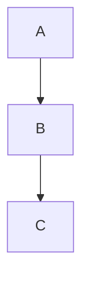

# Documentation Skill

## Purpose
Keep the AI knowledge base and developer documentation accurate and up-to-date.

## When to Use
- New features added that change architecture
- New API endpoints discovered
- New domain rules found
- New coding patterns introduced
- After major bug fixes (document root cause + fix)

## Knowledge Base Files

| File | Update When |
|------|------------|
| `.project-ai/project-context.md` | New module added, objectives changed |
| `.project-ai/architecture.md` | Architecture changes (new providers, proxy changes) |
| `.project-ai/coding-rules.md` | New rules, new anti-patterns discovered |
| `.project-ai/domain-rules.md` | New business rules discovered |
| `.project-ai/api-map.md` | New endpoints found or changed |
| `.project-ai/database-map.md` | Schema changes, new tables/columns |
| `.project-ai/frontend-guide.md` | New shared components, new UI patterns |
| `.project-ai/test-guide.md` | New test files, new test patterns |
| `.project-ai/loop-engineering.md` | Workflow improvements |

## Workflow

1. **Identify** which knowledge file needs updating
2. **Read** the existing file
3. **Make minimal, accurate updates** — do not rewrite what's correct
4. **Use consistent formatting** — tables, code blocks, Mermaid diagrams
5. **Verify** accuracy against actual source code

## Checklist
- [ ] Only accurate information — verify against actual code
- [ ] Consistent Markdown formatting with rest of file
- [ ] Code examples use actual project patterns
- [ ] Mermaid diagrams syntactically valid
- [ ] No duplicate content with other knowledge files
- [ ] File cross-references updated if needed

## Constraints
- Never document speculative features ("might need X in future")
- Never remove existing accurate documentation
- Keep code examples minimal and runnable
- Thai language OK for descriptions; code must be in English

## Format Standards

### Tables
```markdown
| Column 1 | Column 2 | Column 3 |
|----------|----------|----------|
| value    | value    | value    |
```

### Code Examples
Always include language tag and real project imports:
```typescript
import { apiFetch } from '@/utils/api';
// real example from codebase
```

### Mermaid Diagrams


## Example Task
> "Document the new `/sales/planning` module that was just added"

1. Add module to project-context.md modules table
2. Add new routes to api-map.md
3. Add any new domain rules to domain-rules.md
4. Update frontend-guide.md if new shared components created
