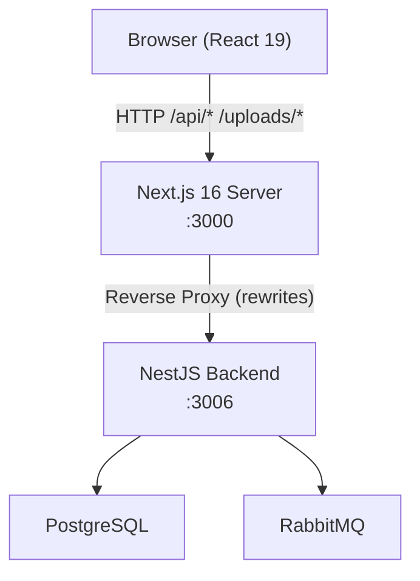
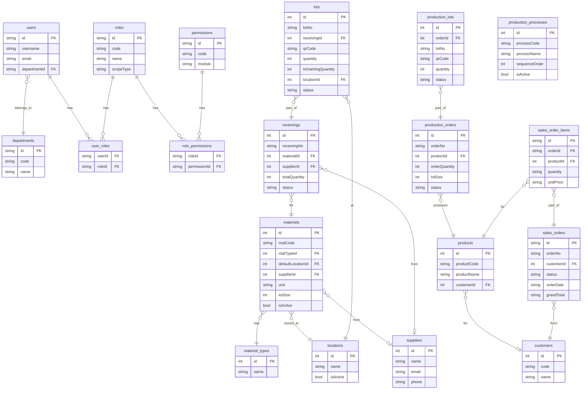
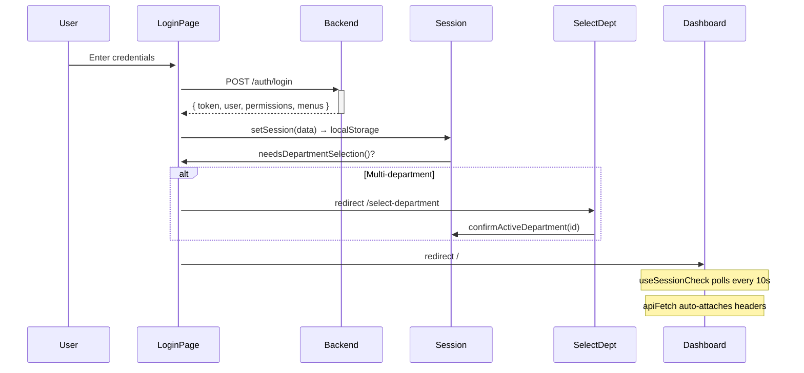

# Architecture — CCI Frontend

## High-Level Architecture



## Frontend Architecture

```mermaid
graph TD
    RootLayout["RootLayout\nThemeProvider + SidebarProvider + MswLoader"]
    AdminLayout["AdminLayout (admin)\nToastProvider + useSessionCheck"]
    FullWidthLayout["FullWidthLayout\nsingin, signup, select-department"]

    RootLayout --> AdminLayout
    RootLayout --> FullWidthLayout

    AdminLayout --> Pages["Pages\n/pc, /production, /sales, /users, /master-data"]
    Pages --> Components["Components\nshared/, pc/, production/, sales/"]
    Components --> Services["Services\nauthService, materialService, ..."]
    Services --> ApiUtils["Utils: apiFetch / apiFetchJson"]
    ApiUtils -->|"with auth headers"| Proxy["Next.js Proxy"]
```



### Context Provider Tree
```
RootLayout
  ThemeProvider          ← dark/light (localStorage)
    SidebarProvider      ← expanded/collapsed state
      MswLoader          ← MSW dev mocking
        AdminLayout
          ToastProvider  ← publishToast() global notifications
            AdminOverlayProvider  ← overlay counter
              PageTitleProvider   ← page title/description
                AdminLayoutContent
                  AppSidebar
                  AppHeader
                  {page children}
```

## Backend Architecture

NestJS monolith with domain modules:
- `auth/` — login, JWT, roles, permissions, departments, menus
- `masters/` — materials, suppliers, locations, products, customers, units, models
- `pc/` — receiving (inbound), outbound, lots, stock
- `production/` — production orders, lots, processes, steps, scanning
- `sales/` — orders, approvals, customers, export

## Database Architecture (Inferred from Types)



## Data Flow

### API Request Flow
```
Component
  → apiFetch(endpoint, options)
      → getApiUrl()           // NEXT_PUBLIC_API_BASE_URL + endpoint
      → applySessionAuthHeaders()  // x-user-id, x-username, x-department-id, Bearer
      → AbortController (20s timeout)
      → fetch(url)
          → Next.js Dev Server
              → rewrites: /api/* → http://127.0.0.1:3006/*
                  → NestJS Backend
  ← Response
      → 401: clearSession() + redirect /signin
      → 403: publishToast(forbidden)
      → ok: return Response / throw ApiError
```

### Authentication Flow

