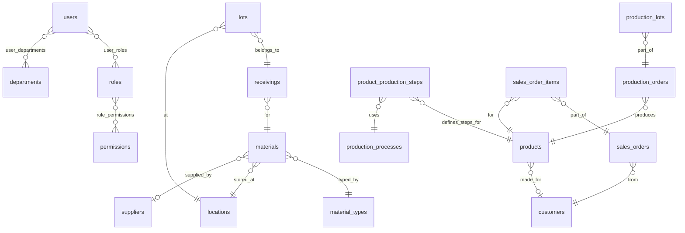

# Database Map — CCI Frontend

> Inferred from TypeScript types in `src/types/*`, service files, and API response shapes.  
> Actual schema lives in the NestJS backend (separate repo).

---

## Core Tables

### `users`
| Column | Type | Notes |
|--------|------|-------|
| id | string (UUID) | PK |
| username | string | unique |
| email | string | unique |
| firstName | string | |
| lastName | string | |
| isActive | boolean | soft-delete |
| departmentId | string? | FK → departments (primary) |

### `roles`
| Column | Type | Notes |
|--------|------|-------|
| id | string (UUID) | PK |
| code | string | unique, e.g. `ADMIN_GLOBAL` |
| name | string | |
| description | string? | |
| isSystem | boolean | system roles cannot be deleted |
| scopeType | `GLOBAL \| DEPARTMENT` | |

### `permissions`
| Column | Type | Notes |
|--------|------|-------|
| id | string (UUID) | PK |
| code | string | unique, e.g. `inbound.create` |
| name | string | |
| description | string? | |
| module | string | grouping: `pc`, `sales`, `production`, etc. |

### `departments`
| Column | Type | Notes |
|--------|------|-------|
| id | string (UUID) | PK |
| code | string | UPPERCASE, unique, e.g. `PC`, `WE` |
| name | string | |
| description | string? | |
| createdAt | datetime | |
| updatedAt | datetime | |

### Junction Tables
- `user_roles` (userId, roleId)
- `user_departments` (userId, departmentId) — multi-dept membership
- `role_permissions` (roleId, permissionId)

---

## Materials Domain

### `materials`
| Column | Type | Notes |
|--------|------|-------|
| id | int | PK |
| matCode | string | unique |
| matTypeId | int | FK → material_types |
| defaultLocationId | int | FK → locations |
| supplierId | int? | FK → suppliers |
| lr | string | left/right classification |
| lotSize | int | default lot split size |
| unit | string | measurement unit |
| isActive | boolean | |
| workpieceImagePath | string? | upload path |
| createDate | datetime | |
| createBy | string | |
| updateDate | datetime? | |
| updateBy | string? | |

### `material_types`
| Column | Type | Notes |
|--------|------|-------|
| id | int | PK |
| name | string | |
| description | string? | |
| isActive | boolean | |

### `locations`
| Column | Type | Notes |
|--------|------|-------|
| id | int | PK |
| name | string | |
| description | string? | |
| isActive | boolean | |

### `suppliers`
| Column | Type | Notes |
|--------|------|-------|
| id | int | PK |
| code | string | |
| name | string | |
| contact_person | string? | |
| phone | string? | |
| email | string? | |
| address | string? | |
| isActive | boolean | |
| create_date | datetime | |

### `receivings`
| Column | Type | Notes |
|--------|------|-------|
| id | int | PK |
| receivingNo | string | unique, auto-generated |
| receivingDate | datetime | |
| materialId | int | FK → materials |
| supplierId | int? | FK → suppliers |
| totalQuantity | int | |
| unit | string | |
| poNo | string? | purchase order number |
| remark | string? | |
| status | `ACTIVE \| PARTIAL_USED \| USED_UP` | |
| createBy | string | |
| createDate | datetime | |

### `lots`
| Column | Type | Notes |
|--------|------|-------|
| id | int | PK |
| lotNo | string | unique |
| receivingId | int | FK → receivings |
| qrCode | string | encoded identity |
| quantity | int | original quantity |
| remainingQuantity | int | decremented on outbound |
| unit | string | |
| locationId | int | FK → locations |
| expiryDate | datetime? | |
| status | `ACTIVE \| PARTIAL_USED \| USED_UP` | |
| createDate | datetime | |

---

## Production Domain

### `products`
| Column | Type | Notes |
|--------|------|-------|
| id | int | PK |
| productCode | string | unique |
| productName | string | |
| productImagePath | string? | |
| customerId | int? | FK → customers |

### `customers`
| Column | Type | Notes |
|--------|------|-------|
| id | int | PK |
| code | string | |
| name | string | |

### `production_processes`
| Column | Type | Notes |
|--------|------|-------|
| id | int | PK |
| processCode | string | unique |
| processName | string | |
| sequenceOrder | int | execution order |
| isActive | boolean | |
| allowedDepartmentCodes | string[]? | null = all depts |

### `product_production_steps`
| Column | Type | Notes |
|--------|------|-------|
| id | int | PK |
| productId | int | FK → products |
| processId | int | FK → production_processes |
| stepOrder | int | |
| createDate | datetime | |
| createBy | string? | |

### `production_orders`
| Column | Type | Notes |
|--------|------|-------|
| id | int | PK |
| orderNo | string | unique |
| productId | int | FK → products |
| orderQuantity | int | |
| lotSize | int | |
| totalLots | int | |
| status | string | `PENDING \| IN_PROGRESS \| COMPLETED \| CANCELLED` |
| remarks | string? | |

### `production_lots`
| Column | Type | Notes |
|--------|------|-------|
| id | int | PK |
| orderId | int | FK → production_orders |
| lotNo | string | |
| lotPdNo | string? | |
| qrCode | string | |
| sequenceNo | int | |
| quantity | int | |
| status | string | |

### `production_lot_tracking`
| Column | Type | Notes |
|--------|------|-------|
| id | int | PK |
| lotId | int | FK → production_lots |
| processCode | string | |
| status | string | |
| startTime | datetime? | |
| endTime | datetime? | |
| operator | string? | |
| remarks | string? | |

---

## Sales Domain

### `sales_orders`
| Column | Type | Notes |
|--------|------|-------|
| id | string (UUID) | PK |
| orderNo | string | unique, auto-generated |
| customerId | int | FK → customers |
| salesUserId | string? | FK → users |
| status | `DRAFT \| PENDING \| APPROVED \| PROCESSING \| SHIPPING \| COMPLETED \| CANCELLED` | |
| salesChannel | string? | |
| orderDate | datetime | |
| deliveryDate | datetime? | |
| requiredDate | datetime? | |
| grandTotal | decimal | |
| subtotal | decimal? | |
| discountTotal | decimal? | |
| note | string? | |
| createDate | datetime | |

### `sales_order_items`
| Column | Type | Notes |
|--------|------|-------|
| id | string (UUID) | PK |
| orderId | string | FK → sales_orders |
| productId | int | FK → products |
| quantity | decimal | |
| unitPrice | decimal | |
| discount | decimal | |
| lineTotal | decimal | |

### `sales_order_status_history`
| Column | Type | Notes |
|--------|------|-------|
| id | string | PK |
| orderId | string | FK → sales_orders |
| fromStatus | SalesOrderStatus? | |
| toStatus | SalesOrderStatus | |
| reason | string? | |
| changedBy | string? | |
| changedAt | datetime | |

### `sales_order_approvals`
| Column | Type | Notes |
|--------|------|-------|
| id | string | PK |
| orderId | string | FK → sales_orders |
| decision | `APPROVED \| REJECTED` | |
| reason | string? | |
| approverId | string | FK → users |
| decidedAt | datetime | |

### `stock_movements`
| Column | Type | Notes |
|--------|------|-------|
| id | string | PK |
| orderId | string | FK → sales_orders |
| productId | int | FK → products |
| movement | `IN \| OUT \| RESERVE \| RELEASE` | |
| quantity | decimal | |
| note | string? | |
| createDate | datetime | |

---

## Sales Planning Domain

### `sales_planning_batches`
| Column | Type | Notes |
|--------|------|-------|
| id | int | PK |
| batchCode | string | unique auto-generated |
| year | int | plan year |
| month | int | plan month (1-12) |
| status | string | `PENDING \| VALIDATED \| COMMITTED \| FAILED` |
| fileName | string | uploaded Excel filename |
| totalRows | int | |
| successRows | int | |
| errorRows | int | |
| skippedRows | int | |
| uploadedAt | datetime | |
| processedAt | datetime? | |
| processingDurationMs | int? | |
| errorSummary | JSON? | `{ validationErrors, businessRuleErrors, byErrorCode, skippedRows }` |

### `sales_planning_rows`
| Column | Type | Notes |
|--------|------|-------|
| id | int | PK |
| batchId | int | FK → sales_planning_batches |
| customerCode | string | |
| productCode | string | |
| saleDate | date | |
| quantity | int | |
| status | `VALID \| INVALID \| SKIPPED` | |

### `sales_planning_errors`
| Column | Type | Notes |
|--------|------|-------|
| id | int | PK |
| batchId | int | FK → sales_planning_batches |
| rowNumber | int | |
| errorType | string | |
| errorCode | string | |
| errorMessage | string | |
| fieldName | string | |
| severity | `ERROR \| WARNING \| INFO` | |

---

## Sales Import Domain

### `sales_import_batches`
| Column | Type | Notes |
|--------|------|-------|
| id | string (UUID) | PK |
| batchCode | string | |
| fileName | string | |
| uploadedBy | int | FK → users |
| status | `PENDING \| VALIDATED \| COMMITTED \| FAILED` | |
| totalRows | int | |
| validRows | int | |
| errorRows | int | |
| committedRows | int | |
| errorSummary | JSON? | `Record<string, number>` |
| createdAt | datetime | |
| committedAt | datetime? | |

### `sales_import_rows`
| Column | Type | Notes |
|--------|------|-------|
| id | string | PK |
| batchId | string | FK → sales_import_batches |
| rowNumber | int | |
| status | `PENDING \| VALID \| ERROR \| COMMITTED` | |
| orderGroup | string? | groups rows into one order |
| customerCode | string? | |
| productCode | string? | |
| quantity | decimal? | |
| unitPrice | decimal? | |
| discount | decimal? | |
| requiredDate | date? | |
| deliveryDate | date? | |
| salesChannel | string? | |
| errorCode | string? | |
| errorMessage | string? | |
| orderId | string? | FK → sales_orders (after commit) |

---

## Production Lot Split Domain

### `production_lot_split_traces`
| Column | Type | Notes |
|--------|------|-------|
| parentLotId | int | FK → production_lots |
| parentLotNo | string | |
| splitMode | `FIRST_PROCESS \| GENERAL` | |
| reason | string | |
| operator | string | |
| releasedQuantity | int | quantity moved to children |
| remainingQuantity | int | quantity kept in parent |
| splitAt | datetime | |

---

## ER Diagram (Simplified)

