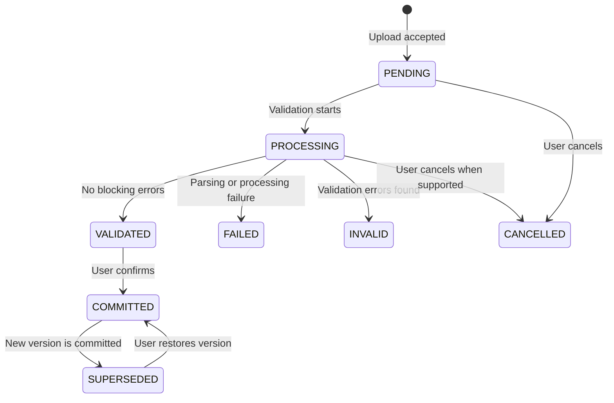

# Sales Planning Upload - Requirement Design Spec

## 1. Document Status

- Date: 2026-07-06
- Module: Sales Planning
- Route family: `/sales-planning/*`
- Status: Design approved for planning
- Source: Sales Order Upload requirement, `docs/PROJECT-WIKI.md`, current Sales Planning pages and service contracts

## 2. Objective

Extend the existing Sales Planning module so users can upload a monthly `.xlsx` sales plan, validate and preview every row, confirm an all-or-nothing import, search active planning data, inspect upload history, restore a previous version, and export filtered data.

The design must preserve existing `/sales-planning/*` endpoints and response shapes. It must not introduce a separate `/sales-orders/*` module because Sales Order management already represents a different business workflow.

## 3. Confirmed Decisions

| Topic | Decision |
|-------|----------|
| Module | Extend the existing `/sales-planning/*` module |
| Import lifecycle | Upload and validate first, then explicit user confirmation |
| Duplicate period handling | Versioned Replace |
| Active data | One active committed batch per year and month |
| Failed rows | All-or-Nothing; any `ERROR` blocks confirmation |
| Warnings | Visible in preview but do not block confirmation |
| Master validation | Validate Customer and Part No against Master Data |
| Other dimensions | Require and normalize Model, Gate, Location, Round, and Line |
| Storage | Normalize day columns into daily detail rows |
| Backward compatibility | Keep existing endpoints and support legacy batch statuses |

## 4. Existing System Alignment

The frontend already provides:

- `/sales-planning/import` for file upload and history
- `/sales-planning/import/[batchId]` for batch rows and errors
- `/sales-planning/data` for planning data
- `salesPlanningService` with template, upload, status, rows, errors, history, download, cancel, reprocess, and data APIs

The extension adds the missing preview-confirm boundary, active-version behavior, restore behavior, additional planning dimensions, filtered export, route constants, and access policies.

## 5. Scope

### In Scope

- Download a period-aware Excel template
- Upload `.xlsx` files for a selected year and month
- Validate template metadata, headers, values, Master Data, totals, dates, and duplicate keys
- Preview valid rows, errors, warnings, and summary totals
- Confirm only a fully valid batch
- Replace the active period through a versioned transaction
- Restore a superseded batch
- Search and aggregate active planning data
- Export filtered active data to Excel
- View import and audit history
- Apply route and action permissions

### Out of Scope

- Creating a new Sales Order module or changing Sales Order lifecycle rules
- Editing imported quantities directly in the preview table
- Partial import of valid rows
- Automatic creation of missing Customer or Part Master Data
- Adding new permission codes without matching backend support
- Changing existing endpoint paths or existing response envelopes

## 6. User Roles and Permissions

Use existing permission constants until the backend introduces dedicated Sales Planning permissions.

| Capability | Permission |
|------------|------------|
| View planning data and batch details | `SALES_ORDER_READ` |
| Upload, confirm, cancel, reprocess, and restore | `SALES_ORDER_IMPORT` |
| Export planning data or download batch files | `SALES_ORDER_EXPORT` |
| Admin bypass | Existing `ADMIN_GLOBAL` behavior |

All Sales Planning routes must be registered in `ROUTES` and `accessControl.ts`. Unregistered routes must continue to use the current deny-by-default behavior.

## 7. Excel Contract

### 7.1 File Rules

- Accepted extension: `.xlsx` only
- Maximum file size: 10 MB
- One planning data sheet per workbook
- Template metadata must contain the selected Gregorian year and month
- The backend is the source of truth for parsing and validation
- Processing is asynchronous so large files do not block the request lifecycle

### 7.2 Required Columns

| Column | Rule |
|--------|------|
| Customer | Required; must match Customer Master Data by code or normalized exact name |
| Model | Required; trimmed and normalized |
| Part No | Required; must match Product/Part Master Data |
| Part Name | Required; compared with the canonical Master Data name |
| Gate | Required; trimmed and normalized |
| Location | Required; trimmed and normalized |
| Round | Required; trimmed and normalized |
| Line | Required; trimmed and normalized |
| `1` through `31` | Non-negative integer quantity or blank |
| Total | Non-negative integer equal to the sum of days 1-31 |

Required headers must match the template exactly after trimming surrounding whitespace. Missing, duplicated, or unexpected structural headers are validation errors.

### 7.3 Business Key

Rows are uniquely identified within a period by:

```text
year + month + customer + model + partNo + gate + location + round + line
```

The normalized value of each text field is used for duplicate detection. Duplicate keys inside the same workbook are errors.

### 7.4 Date Rules

- The selected year and month define the dates represented by columns 1-31
- Leap-year rules apply to February
- Columns beyond the actual number of days in the selected month must be blank or zero
- Each actual calendar day becomes one daily detail record, including days with zero quantity
- Days outside the selected month do not create daily detail records

Customer matching checks the Customer code first, then a normalized exact Customer name. No match or more than one name match is an error. Part No matches the canonical part/product code exactly after trimming. A Part Name mismatch is a warning, and active planning data uses the canonical Master Data name.

## 8. Batch Lifecycle



Rules:

- `VALIDATED` means preview-ready and not active
- `INVALID` means preview is available but confirmation is blocked
- `COMMITTED` means the active version for its year and month
- `SUPERSEDED` remains immutable and available for audit or restore
- `FAILED` represents a technical failure and is eligible for reprocessing
- Legacy `COMPLETED` and `PARTIAL` statuses remain displayable for backward compatibility

## 9. Versioned Replace and Restore

### 9.1 Commit

The backend must commit in one database transaction:

1. Lock the target year/month planning period
2. Recheck that the candidate batch is `VALIDATED` and has zero blocking errors
3. Mark the current active batch `SUPERSEDED`, if one exists
4. Persist or activate the new normalized planning rows
5. Mark the candidate batch `COMMITTED`
6. Record actor, timestamp, previous batch, and new batch in the audit log

If any step fails, the previous active version remains unchanged.

### 9.2 Restore

Restore uses the same transaction and lock rules as commit. The selected superseded batch becomes `COMMITTED`, while the currently active batch becomes `SUPERSEDED`. Restored data must be the immutable data originally committed with that batch.

## 10. Data Model

The backend implementation uses its existing migration and naming conventions. The API-visible model must represent these concepts.

### 10.1 Planning Batch

| Field | Purpose |
|-------|---------|
| `id`, `batchCode` | Batch identity |
| `year`, `month`, `version` | Planning period and version |
| `fileName`, `fileSize` | Source file metadata |
| `status` | Batch lifecycle status |
| `totalRows`, `successRows`, `errorRows`, `warningRows`, `skippedRows` | Validation summary |
| `replacesBatchId` | Previous active batch |
| `uploadedBy`, `uploadedAt` | Upload audit |
| `committedBy`, `committedAt` | Commit audit |
| `restoredBy`, `restoredAt` | Restore audit when applicable |
| `processedAt`, `processingDurationMs` | Processing audit |

### 10.2 Planning Group

One record represents the monthly business key and contains Customer, Model, Part No, Part Name, Gate, Location, Round, Line, period, monthly total, batch identity, and version identity.

### 10.3 Planning Day

One record represents `planningGroupId`, `saleDate`, `dayNo`, and `quantity`. The database must prevent duplicate dates within the same planning group.

### 10.4 Validation Issue

Each issue contains batch identity, row number, field name, error code, message, severity, field value, and optional structured details.

## 11. API Design

### 11.1 Existing Endpoints Retained

| Method | Endpoint | Purpose |
|--------|----------|---------|
| `GET` | `/sales-planning/template` | Download template; accepts optional year/month query |
| `POST` | `/sales-planning/import` | Upload file and create validation batch |
| `GET` | `/sales-planning/import/:id/status` | Poll processing status |
| `GET` | `/sales-planning/import/:id/rows` | Preview rows with filters and pagination |
| `GET` | `/sales-planning/import/:id/errors` | Validation issues with filters and pagination |
| `GET` | `/sales-planning/import/:id/detail` | Batch summary and initial preview data |
| `POST` | `/sales-planning/import/history` | Search import history |
| `POST` | `/sales-planning/import/:id/cancel` | Cancel eligible batch |
| `POST` | `/sales-planning/import/:id/reprocess` | Retry eligible failed batch |
| `GET` | `/sales-planning/import/:id/download` | Download original or normalized batch file |
| `GET` | `/sales-planning` | Search active planning data |

### 11.2 New Endpoints

| Method | Endpoint | Purpose |
|--------|----------|---------|
| `POST` | `/sales-planning/import/:id/commit` | Confirm a validated batch |
| `POST` | `/sales-planning/import/:id/restore` | Restore a superseded batch |
| `GET` | `/sales-planning/export` | Export active data using current filters |

All JSON endpoints use the existing `ApiResponse<T>` envelope. Excel endpoints return `Blob`. Existing endpoint response shapes are extended only through optional backward-compatible fields.

## 12. Functional Requirements

### FR-01: Select Period and Upload

The user must select year and month, then choose one `.xlsx` file. Upload is disabled until all inputs are valid.

### FR-02: Validate Template and Metadata

The backend validates file type, size, workbook structure, required headers, and template year/month against the selected period.

### FR-03: Validate Rows

The backend validates required fields, numeric values, monthly totals, real calendar days, duplicate keys, Customer Master Data, and Part Master Data.

### FR-04: Preview Before Commit

The batch detail page displays total rows, valid rows, errors, warnings, row-level details, and normalized preview data before any planning data becomes active.

### FR-05: All-or-Nothing Confirmation

Confirmation is allowed only when the batch status is `VALIDATED` and the blocking error count is zero. Warnings require visibility but do not block confirmation.

### FR-06: Versioned Replace

Confirming a new batch for an existing period supersedes the current active batch and activates the new batch atomically.

### FR-07: Restore Previous Version

Authorized users can restore a superseded batch. Restore must be atomic and auditable.

### FR-08: Search Active Planning Data

Users can filter by year, month, Customer, Model, Part No, Gate, Location, Round, Line, and date range. Results use only the active committed version.

### FR-09: Summaries

The system provides daily totals, monthly totals, and grouped totals by Customer, Part No, Gate, Location, Round, and Line for the active filtered dataset.

### FR-10: Import History

History includes file name, period, version, row counts, status, uploader, upload time, committer, commit time, replacement relationship, and error summary.

### FR-11: Export

Authorized users can export the active filtered dataset to `.xlsx`. Exported totals must equal the displayed filtered totals.

### FR-12: Template Download

Users can download the current template. When year and month are supplied, the template embeds period metadata used during upload validation.

## 13. Frontend Design

### 13.1 `/sales-planning/import`

- Period picker
- Template download action
- File selector and upload action
- Upload/validation progress
- Import history table
- Navigation to batch detail after upload

The file selector accepts `.xlsx` only. The current `.xls` acceptance must be removed when this requirement is implemented.

### 13.2 `/sales-planning/import/[batchId]`

- Batch status and audit summary
- Counts for total, valid, error, warning, and skipped rows
- Tabs for preview rows, errors, and warnings
- Filterable and paginated issue table
- Confirm action for eligible validated batches
- Restore action for eligible superseded batches
- Cancel, reprocess, and download actions where status permits

Confirm and Restore require a confirmation modal. Success and failure feedback use `publishToast()`.

### 13.3 `/sales-planning/data`

- Filters for all confirmed dimensions
- Daily and monthly summary metrics
- Grouped result table with daily detail access
- Clear filters action
- Export action using the same filter state
- Empty, loading, and error states from shared components

### 13.4 Shared Project Rules

- Routes use `ROUTES.*`
- Permissions use `PERMISSIONS.*`
- API calls use `salesPlanningService` with `apiFetch` or `apiFetchJson`
- Types live in `src/types/*`, not in pages or service files
- Pages using `useSearchParams` are wrapped in `React.Suspense`
- Async functions use `try/catch/finally`
- Generic UI uses `@/components/shared`

## 14. Error Model

```typescript
type PlanningIssueSeverity = "ERROR" | "WARNING" | "INFO";

interface PlanningValidationIssue {
  id: number;
  rowNumber: number;
  fieldName: string | null;
  fieldValue: string | null;
  errorCode: string;
  message: string;
  severity: PlanningIssueSeverity;
  details?: Record<string, unknown>;
}
```

Representative error codes:

| Code | Severity | Meaning |
|------|----------|---------|
| `INVALID_FILE_TYPE` | ERROR | File is not `.xlsx` |
| `FILE_TOO_LARGE` | ERROR | File exceeds 10 MB |
| `PERIOD_MISMATCH` | ERROR | Template metadata differs from selected period |
| `MISSING_HEADER` | ERROR | Required header is absent |
| `INVALID_QUANTITY` | ERROR | Quantity is not a non-negative integer |
| `INVALID_CALENDAR_DAY` | ERROR | Out-of-month day contains a non-zero value |
| `TOTAL_MISMATCH` | ERROR | Total differs from day-column sum |
| `DUPLICATE_BUSINESS_KEY` | ERROR | Duplicate normalized key in the workbook |
| `CUSTOMER_NOT_FOUND` | ERROR | Customer is absent from Master Data |
| `CUSTOMER_AMBIGUOUS` | ERROR | Customer name matches more than one Master Data record |
| `PART_NOT_FOUND` | ERROR | Part No is absent from Master Data |
| `PART_NAME_MISMATCH` | WARNING | Part Name differs from the canonical Master Data name |
| `NORMALIZED_VALUE` | WARNING | Input value was normalized |

## 15. Non-Functional Requirements

- Validation runs asynchronously and exposes pollable progress
- Commit and restore are idempotent and transaction-safe
- Concurrent operations for the same year/month are serialized
- Only one active committed batch can exist per year/month
- Audit records are immutable
- Search and export use server-side filtering
- List endpoints are paginated
- User-facing messages are concise and identify row and field where applicable
- Existing session, authentication, proxy, and API response behavior remains unchanged
- No direct browser parsing is trusted as the validation source of truth

## 16. Backward Compatibility

- Existing `/sales-planning/*` paths remain unchanged
- Existing upload and history consumers continue receiving their current response fields
- New response fields are optional until all clients are updated
- The frontend continues to render legacy `COMPLETED` and `PARTIAL` statuses
- Existing batch download, cancel, reprocess, and delete behavior remains available unless the backend status rules explicitly disallow an action
- No existing Sales Order endpoint or status transition is changed

## 17. Test Strategy

### Unit Tests

- Header validation
- Whitespace and case normalization
- Non-negative integer quantities
- Total calculation
- February and leap-year handling
- 30-day and 31-day month handling
- Duplicate business key detection
- Customer and Part Master Data validation

### API Integration Tests

- Upload to validation status transitions
- Invalid batch cannot commit
- Warning-only batch can commit
- Commit supersedes the active version
- Failed commit preserves the prior active version
- Restore reverses the active version safely
- Concurrent commits result in one active version
- Export totals match filtered query totals

### Frontend E2E Tests

- Valid `.xlsx` upload, preview, and confirm
- Invalid extension, size, period, header, quantity, and total
- Error and warning tabs
- Permission-based action visibility
- History and batch detail navigation
- Data filters, summaries, and export
- Restore confirmation workflow

### Required Verification

```bash
pnpm build
pnpm lint
pnpm test:e2e
```

## 18. Acceptance Criteria

- A valid workbook can be uploaded, previewed, confirmed, searched, and exported
- No imported planning data becomes active before explicit confirmation
- Any blocking row error prevents confirmation
- A warning-only batch can be confirmed
- Only one active version exists per year/month
- Confirm and restore preserve audit history and are atomic
- Active planning queries never mix superseded versions
- Daily and monthly totals match the uploaded workbook
- Customer and Part No are validated against Master Data
- Existing Sales Planning endpoint paths and Sales Order behavior remain compatible
- Unauthorized users cannot view or execute restricted actions
