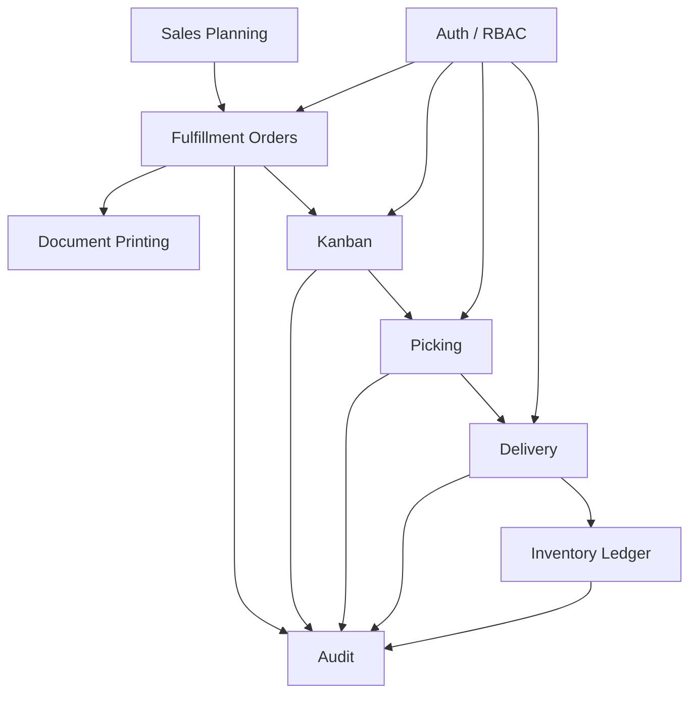
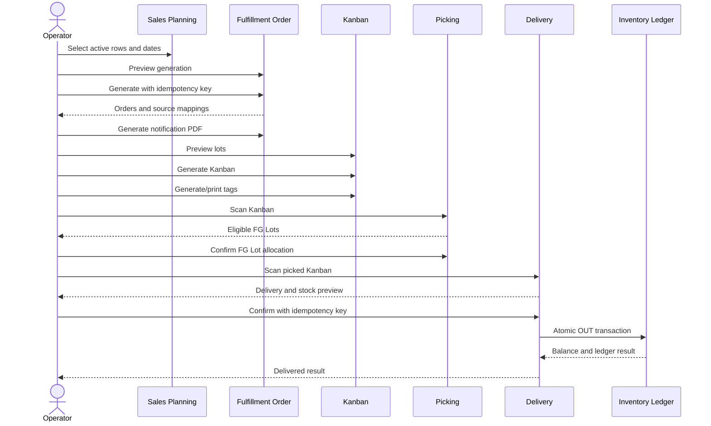
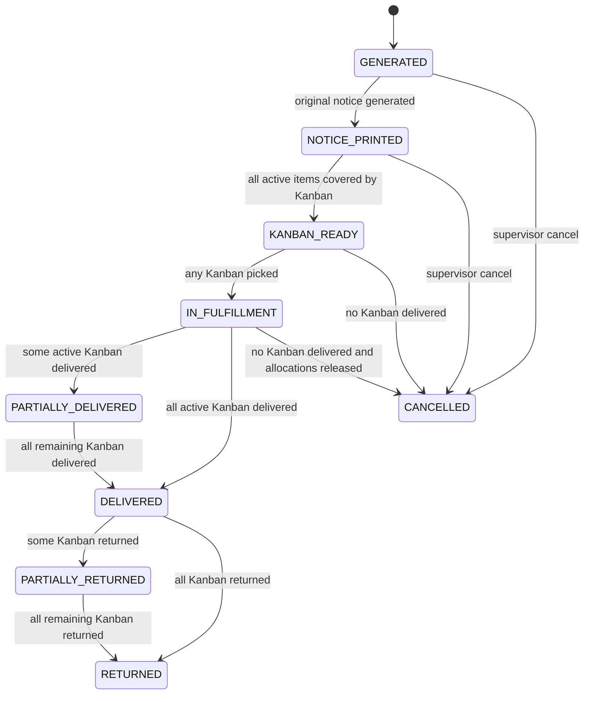
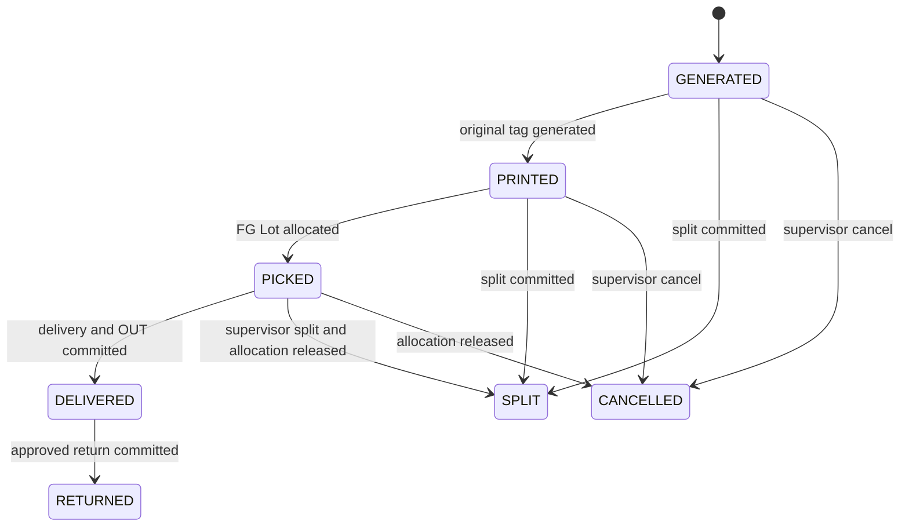
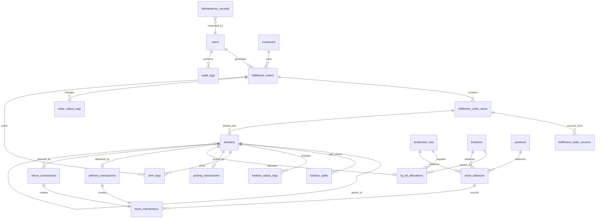

# Order, Kanban and Delivery Management

## Backend Requirements - Phase 1 to Phase 6

## Document Status

| Item | Value |
|------|-------|
| Date | 2026-07-07 |
| Status | Review draft |
| Runtime | NestJS Modular Monolith |
| Database | PostgreSQL |
| Background processing | RabbitMQ |
| Source business requirement | `2026-07-07-order-kanban-delivery-phase-1-business-requirement.md` |

This document defines backend responsibilities only. Existing Sales Planning and Sales Order APIs remain backward compatible. The new operational aggregate uses the `/fulfillment/*` namespace to avoid collision with the existing Sales Order lifecycle.

---

## Phase 1: Business Requirement

### 1.1 Backend Objectives

- Generate fulfillment orders from selected rows of the active committed Sales Planning version.
- Guarantee one operational result for one planning source selection.
- Generate immutable Order Codes, Kanban Numbers, and opaque QR tokens.
- Preserve Product, FG Lot, Warehouse Location, Kanban, Order, user, and department traceability.
- Make Delivery and Stock OUT one atomic, idempotent transaction.
- Preserve immutable ledger, print, split, status, delivery, return, and audit history.

### 1.2 Backend Scope

- Fulfillment Order aggregate and planning-source mapping
- Order notification PDF and print logs
- Kanban generation, PDF tag, QR token, and split history
- FG Lot picking allocation
- Delivery confirmation and stock ledger
- Cancellation, allocation release, and Return
- Action-based RBAC enforcement
- Dashboard, report, export, and audit query APIs
- Background jobs for PDF/report generation where synchronous generation exceeds request limits

### 1.3 Canonical Business Decisions

| Area | Rule |
|------|------|
| Order source | Active committed Sales Planning only |
| Order grouping | `saleDate + customer + gate + location + round + line` |
| Order Code | `OR-{YYMMDD}-{CUSTOMER_CODE}-{SEQ6}` |
| Kanban quantity | Product Master standard quantity, snapshotted on generation |
| Picking source | One Product + one FG Lot + one Warehouse Location per Kanban |
| Partial shipment | Split Kanban first; Kanban delivery is atomic |
| Cancellation | Allowed before Delivery with Supervisor authorization |
| Post-delivery correction | Return transaction; original OUT remains immutable |
| Return quantity | Full delivered Kanban quantity; partial Return is not allowed |
| Printing | Backend-generated PDF |

### 1.4 Backend Acceptance Criteria

- Duplicate generation, picking, delivery, or stock deduction cannot create duplicate records.
- Failed Delivery rolls back Kanban, allocation, delivery, stock balance, ledger, status log, and audit changes.
- Concurrent Delivery requests produce one committed OUT transaction.
- Split children sum exactly to the parent and retire the parent.
- Every protected command verifies permission and department scope server-side.

---

## Phase 2: System Analysis

### 2.1 Module Boundaries



Module ownership:

| Module | Owns | Must not own |
|--------|------|--------------|
| `fulfillment-orders` | Order aggregate, source rows, code generation, order state | Stock mutation |
| `documents` | PDF generation and print log creation | Order/Kanban state authority |
| `kanban` | Kanban aggregate, numbering, QR token, split tree | Stock balance |
| `picking` | FG Lot allocation and picking transaction | Physical stock deduction |
| `delivery` | Delivery command orchestration and idempotency | Independent stock rules |
| `inventory-ledger` | Balance locking, OUT/RETURN ledger, reconciliation | Kanban state transitions |
| `audit` | Immutable action history | Business-state mutation |

### 2.2 End-to-End Flow



### 2.3 Order State Machine



Rules:

- `CANCELLED` and `RETURNED` are terminal.
- An Order with any delivered Kanban cannot transition to `CANCELLED`.
- Order status is derived from active non-split Kanban where possible; status updates and history are still persisted transactionally.

### 2.4 Kanban State Machine



Rules:

- `SPLIT`, `CANCELLED`, and `RETURNED` are terminal for the original Kanban.
- `DELIVERED` cannot move backward; a later Return creates a new transaction and changes the business view to `RETURNED`.
- Transient UI states such as scanning or submitting are not persisted domain states.

### 2.5 Exception Flows

| Scenario | Backend behavior | Error code |
|----------|------------------|------------|
| Planning version is no longer active | Reject generation before mutation | `PLANNING_VERSION_INACTIVE` |
| Source row already generated | Return existing mapping or conflict | `ORDER_SOURCE_ALREADY_USED` |
| Product has no standard Kanban quantity | Reject preview/generation | `STANDARD_KANBAN_QTY_MISSING` |
| Parent already split | Reject split | `KANBAN_ALREADY_SPLIT` |
| FG Lot insufficient | Reject picking, return available quantity | `FG_LOT_INSUFFICIENT` |
| Kanban already picked | Return existing picking result for same command | `KANBAN_ALREADY_PICKED` |
| Kanban not picked | Reject delivery | `KANBAN_NOT_PICKED` |
| Stock changed after scan preview | Reject confirmation and request rescan | `STOCK_VERSION_CONFLICT` |
| Duplicate delivery retry | Return stored original result | none; HTTP 200 |
| Same key with different payload | Reject command | `IDEMPOTENCY_KEY_REUSED` |
| Delivered Kanban cancel requested | Reject and direct to Return | `DELIVERED_KANBAN_CANNOT_CANCEL` |

### 2.6 Duplicate Prevention

| Operation | Prevention mechanism |
|-----------|----------------------|
| Order generation | Unique source mapping on planning day row + generation scope |
| Order Code | Server sequence plus unique index |
| Kanban generation | Unique `(order_item_id, generation_version, lot_sequence)` |
| QR token | Cryptographically random token plus unique index |
| Picking | Unique active allocation per Kanban |
| Delivery | Unique `delivery_transactions.kanban_id` plus idempotency record |
| Stock OUT | Partial unique index on `(kanban_id, transaction_type='OUT')` |
| Print | Monotonic print sequence per entity and document type |

### 2.7 Concurrent Update Handling

- Commands load aggregate rows with `SELECT ... FOR UPDATE` inside a transaction.
- Mutable aggregate tables include integer `version` for optimistic checks on non-locking updates.
- Delivery locks Kanban, active allocation, FG Lot balance, and stock balance in a stable order.
- Idempotency record is inserted before command execution using a unique scope/key constraint.
- A command in `PROCESSING` returns HTTP 409 with `REQUEST_IN_PROGRESS`; completed commands return the stored response.
- Database deadlock and serialization failures are retried only at the application transaction boundary with a bounded retry count.

### 2.8 Split Logic

1. Lock parent Kanban and active allocation.
2. Validate status, permission, positive child quantities, and exact total.
3. Release allocation when the parent is `PICKED` and Supervisor authorization is present.
4. Mark parent `SPLIT` and set `retiredAt`.
5. Create child Kanban with new numbers and QR tokens.
6. Create split header, split children, status logs, and audit record.
7. Commit all records atomically.

### 2.9 Stock Deduction Logic

1. Validate idempotency record and request fingerprint.
2. Lock Kanban and verify `PICKED`.
3. Lock picking allocation, FG Lot, and stock balance.
4. Verify allocation quantity equals Kanban quantity and stock is sufficient.
5. Insert Delivery transaction.
6. Insert Stock `OUT` transaction with before/after quantities.
7. Update stock balance projection and FG Lot available quantity.
8. Set Kanban `DELIVERED`, add status log, and recompute Order status.
9. Insert audit record and store idempotent response.
10. Commit once; any error rolls back every step.

---

## Phase 3: Database Design

### 3.1 ERD



### 3.2 Table Definitions

| Table | Primary purpose | Key constraints |
|-------|-----------------|-----------------|
| `fulfillment_orders` | Operational order header | PK `id`; unique `order_code`; index grouping fields/status/date; `version` |
| `fulfillment_order_items` | Product/Model quantities | PK `id`; FK order/product; unique order + product + model; positive quantity |
| `fulfillment_order_sources` | Planning row/date lineage | PK `id`; FK item/planning row; unique planning source identity |
| `order_status_logs` | Immutable order transitions | PK `id`; FK order/user; index order/time |
| `kanbans` | Atomic fulfillment lots | PK `id`; unique number/token; FK item/parent; positive quantity; `version` |
| `kanban_splits` | Split event header and JSON snapshot | PK `id`; FK parent/user; unique parent active split |
| `kanban_status_logs` | Immutable Kanban transitions | PK `id`; FK Kanban/user; index Kanban/time |
| `print_logs` | Original/reprint events | PK `id`; polymorphic entity reference; unique entity/type/sequence |
| `fg_lot_allocations` | Picking reservation | PK `id`; FK Kanban/FG Lot/location; unique active Kanban allocation |
| `picking_transactions` | Picking confirmation | PK `id`; unique Kanban; FK allocation/user |
| `delivery_transactions` | Delivery confirmation | PK `id`; unique Kanban; unique idempotency record; FK user |
| `stock_balances` | Current stock projection | PK `id`; unique product + FG Lot + location; non-negative quantities; `version` |
| `stock_transactions` | Immutable ledger | PK `id`; FK balance/Kanban/Order/user; unique delivery OUT; signed quantity |
| `return_transactions` | Approved post-delivery return | PK `id`; FK Kanban/delivery/user; unique return reference |
| `idempotency_records` | Command deduplication | PK `id`; unique scope + key; request hash; stored response/status |
| `audit_logs` | Immutable cross-domain audit | PK `id`; entity/action/user/request indexes; JSONB old/new values |

### 3.3 Requested Table Mapping

The source requirement lists generic table names. The implementation maps them to existing or domain-specific names to avoid collision with current CCI Sales Order and Sales Planning data.

| Requested concept | Canonical implementation |
|-------------------|--------------------------|
| `users`, `roles`, `permissions`, `user_roles`, `role_permissions` | Reuse existing RBAC tables |
| `order_imports` | Reuse existing Sales Planning import batch table |
| `order_import_errors` | Reuse existing Sales Planning validation issue/error table |
| `orders` | New `fulfillment_orders`; do not reuse existing `sales_orders` |
| `order_items` | New `fulfillment_order_items` |
| `order_daily_quantities` | Reuse normalized Sales Planning day rows; link through `fulfillment_order_sources` |
| `kanbans` | New `kanbans` |
| `kanban_splits` | New `kanban_splits` plus child references in `kanbans` |
| `kanban_print_logs` | Shared `print_logs` scoped to Kanban entity |
| `kanban_status_logs` | New `kanban_status_logs` |
| `picking_transactions` | New `picking_transactions` |
| `delivery_transactions` | New `delivery_transactions` |
| `stock_balances` | New or migrated ledger-backed `stock_balances` projection |
| `stock_transactions` | New immutable `stock_transactions` ledger |
| `audit_logs` | New shared immutable `audit_logs`, integrated with existing audit facilities where available |

### 3.4 Required Columns by Core Table

`fulfillment_orders`:

- `id`, `order_code`, `sale_date`, `customer_id`
- `gate`, `destination_location`, `delivery_round`, `line_code`
- `status`, `source_planning_batch_id`, `version`
- `created_by`, `created_at`, `updated_at`, `cancelled_by`, `cancelled_at`, `cancel_reason`

`fulfillment_order_items`:

- `id`, `order_id`, `product_id`, `model`, `part_no_snapshot`, `part_name_snapshot`
- `quantity`, `standard_kanban_qty_snapshot`, `lot_size_override`, `override_reason`
- `created_at`, `updated_at`

`kanbans`:

- `id`, `kanban_number`, `qr_token_hash`, `order_item_id`, `parent_kanban_id`
- `lot_sequence`, `split_depth`, `quantity`, `status`, `version`
- `printed_at`, `picked_at`, `delivered_at`, `returned_at`, `retired_at`
- audit actor columns for each terminal action

`stock_transactions`:

- `id`, `transaction_code`, `transaction_type`
- `stock_balance_id`, `product_id`, `fg_lot_id`, `location_id`
- `kanban_id`, `order_id`, `reference_type`, `reference_id`
- `quantity`, `before_quantity`, `after_quantity`
- `transaction_at`, `transaction_by`, `request_id`, `remark`

### 3.5 Enum Strategy

Use PostgreSQL enums only for stable lifecycle values:

- `fulfillment_order_status`: `GENERATED`, `NOTICE_PRINTED`, `KANBAN_READY`, `IN_FULFILLMENT`, `PARTIALLY_DELIVERED`, `DELIVERED`, `PARTIALLY_RETURNED`, `RETURNED`, `CANCELLED`
- `kanban_status`: `GENERATED`, `PRINTED`, `PICKED`, `DELIVERED`, `SPLIT`, `CANCELLED`, `RETURNED`
- `stock_transaction_type`: `IN`, `OUT`, `ADJUSTMENT`, `RETURN`
- `print_type`: `ORIGINAL`, `REPRINT`
- `idempotency_status`: `PROCESSING`, `COMPLETED`, `FAILED`

Permission codes and audit action codes remain lookup/data values because they evolve operationally.

### 3.6 Index Strategy

- B-tree: order code, sale date, Customer, status, Gate, Location, Round, Line
- B-tree: Kanban number, token hash, status, Order Item, parent Kanban
- Composite: stock balance `(product_id, fg_lot_id, location_id)`
- Composite: order grouping `(sale_date, customer_id, gate, destination_location, delivery_round, line_code)`
- Partial unique: one active allocation per Kanban
- Partial unique: one `OUT` stock transaction per Kanban
- GIN: audit `old_value`/`new_value` JSONB only when JSON filtering is required
- Time-oriented indexes: status, print, stock, delivery, and audit logs by entity plus descending timestamp

### 3.7 Soft Delete and Immutability

- Master and configurable records use `is_active` or `deleted_at` according to existing conventions.
- Orders and Kanban use lifecycle status, not hard delete.
- Ledger, delivery, picking, print, split, status, idempotency, and audit records cannot be hard-deleted through application APIs.
- Corrections create compensating transactions or new status events.

### 3.8 Transaction Boundaries

| Command | Transaction contents |
|---------|----------------------|
| Generate Order | source locks, order/items/source mappings, status log, audit, idempotency |
| Generate Kanban | item lock, lot calculation, Kanban rows, status changes, audit |
| Split Kanban | parent/allocation lock, release, children, split/status/audit |
| Confirm Picking | Kanban/FG Lot/balance lock, allocation, picking/status/audit |
| Confirm Delivery | idempotency, Kanban/allocation/balance locks, delivery, OUT, balance, statuses, audit |
| Return | delivered Kanban/balance locks, return, RETURN ledger, balance, statuses, audit |

---

## Phase 4: API Design

### 4.1 API Standards

- Base namespace: `/fulfillment`
- JSON response: existing `ApiResponse<T>` envelope
- Pagination: `page`, `limit`, `total`, `totalPages`
- Mutation headers: `Idempotency-Key` and propagated `X-Request-Id`
- Date format: `YYYY-MM-DD`; timestamps: ISO 8601 UTC
- Error body includes `code`, `message`, `details`, `requestId`, and `timestamp`
- Blob endpoints set `Content-Type`, `Content-Disposition`, and stable filename

### 4.2 Endpoint List

| Method | Endpoint | Permission | Purpose |
|--------|----------|------------|---------|
| `POST` | `/fulfillment/orders/preview` | `fulfillment_order.generate` | Preview planning-to-order groups |
| `POST` | `/fulfillment/orders/generate` | `fulfillment_order.generate` | Generate orders idempotently |
| `GET` | `/fulfillment/orders` | `fulfillment_order.read` | Search orders |
| `GET` | `/fulfillment/orders/:id` | `fulfillment_order.read` | Order detail |
| `POST` | `/fulfillment/orders/:id/cancel` | `fulfillment_order.cancel` | Supervisor cancellation |
| `POST` | `/fulfillment/orders/:id/notice/print` | `fulfillment_order.print` | Original PDF and log |
| `POST` | `/fulfillment/orders/:id/notice/reprint` | `fulfillment_order.reprint` | Reprint PDF with reason |
| `POST` | `/fulfillment/orders/:id/kanbans/preview` | `kanban.generate` | Preview lot split |
| `POST` | `/fulfillment/orders/:id/kanbans` | `kanban.generate` | Generate Kanban |
| `GET` | `/fulfillment/kanbans` | `kanban.read` | Search Kanban |
| `GET` | `/fulfillment/kanbans/:id` | `kanban.read` | Kanban detail |
| `POST` | `/fulfillment/kanbans/:id/print` | `kanban.print` | Original tag PDF |
| `POST` | `/fulfillment/kanbans/:id/reprint` | `kanban.reprint` | Reprint tag PDF |
| `POST` | `/fulfillment/kanbans/:id/split` | `kanban.split` | Split Kanban |
| `POST` | `/fulfillment/kanbans/:id/cancel` | `kanban.cancel` | Cancel eligible Kanban |
| `POST` | `/fulfillment/picking/scan` | `picking.scan` | Resolve QR and eligible FG Lots |
| `POST` | `/fulfillment/picking/confirm` | `picking.confirm` | Confirm allocation |
| `POST` | `/fulfillment/delivery/scan` | `delivery.scan` | Resolve picked Kanban and stock preview |
| `POST` | `/fulfillment/delivery/confirm` | `delivery.confirm` | Atomic delivery and OUT |
| `POST` | `/fulfillment/returns` | `stock.return` | Approved return and RETURN ledger |
| `GET` | `/fulfillment/stock/balances` | `stock.read` | Balance search |
| `GET` | `/fulfillment/stock/transactions` | `stock.read` | Ledger search |
| `GET` | `/fulfillment/audit-logs` | `audit.read` | Audit search |
| `GET` | `/fulfillment/dashboard` | `fulfillment_dashboard.read` | Operational KPI |
| `GET` | `/fulfillment/reports/orders` | `fulfillment_report.read` | Order report |
| `GET` | `/fulfillment/reports/export` | `fulfillment_report.export` | Filtered Excel export |

The requested `/order-imports` API family maps to the existing `/sales-planning/import` API family. The requested `/orders` family maps to `/fulfillment/orders` to avoid collision with existing `/sales/orders` behavior.

### 4.3 Endpoint Behavior Matrix

| Endpoint | Request | Response | Validation and business rule | Transaction / Idempotency |
|----------|---------|----------|------------------------------|---------------------------|
| `POST /orders/preview` | Planning batch, dates, filters | Grouped Orders, items, totals, preview token | Active committed planning; visible rows; positive quantities | Read-only consistent snapshot; no idempotency |
| `POST /orders/generate` | Preview token and approved filters | Created/existing Orders and source mappings | Preview unexpired; source unused; grouping unchanged | Write transaction; idempotency required |
| `GET /orders` | Pagination, sort, filters | Paginated Order summaries | Department scope and valid filter values | Read-only; no idempotency |
| `GET /orders/:id` | Order ID | Order detail and timelines | Order exists and is visible | Read-only; no idempotency |
| `POST /orders/:id/cancel` | Reason, expected version | Cancelled Order and released allocations | Supervisor; no delivered Kanban | Write transaction; idempotency required |
| `POST /orders/:id/notice/print` | Expected version | A4 PDF Blob and print metadata headers | Eligible Order; no prior Original print | Print-log transaction; idempotency required |
| `POST /orders/:id/notice/reprint` | Reason, expected version | A4 PDF Blob and print metadata headers | Prior Original exists; reason required | Print-log transaction; idempotency required |
| `POST /orders/:id/kanbans/preview` | Item IDs and optional lot sizes | Calculated lots and reconciled totals | Items active; standard quantity available; override permission | Read-only; no idempotency |
| `POST /orders/:id/kanbans` | Item lot-size decisions and expected versions | Generated Kanban list | Quantities reconcile; no duplicate generation | Write transaction; idempotency required |
| `GET /kanbans` | Pagination, sort, filters | Paginated Kanban summaries | Department scope and valid statuses | Read-only; no idempotency |
| `GET /kanbans/:id` | Kanban ID | Kanban detail, split tree, logs | Kanban exists and is visible | Read-only; no idempotency |
| `POST /kanbans/:id/print` | Expected version | Label PDF Blob | Eligible Kanban; no prior Original tag print | Print-log transaction; idempotency required |
| `POST /kanbans/:id/reprint` | Reason, expected version | Label PDF Blob | Prior Original exists; reason required | Print-log transaction; idempotency required |
| `POST /kanbans/:id/split` | Child quantities, reason, expected version | Retired parent and child Kanban | Eligible status; exact total; Supervisor if Picked | Write transaction; idempotency required |
| `POST /kanbans/:id/cancel` | Reason, expected version | Cancelled Kanban and released allocation | Not Delivered/Split; Supervisor authorization | Write transaction; idempotency required |
| `POST /picking/scan` | Raw QR token | Short-lived scan token, Kanban, eligible FG Lots | Token valid; status Printed; permission and scope | Read-only; no idempotency |
| `POST /picking/confirm` | Scan token, FG Lot, location, versions | Picking and allocation result | One lot covers full quantity; versions current | Write transaction; idempotency required |
| `POST /delivery/scan` | Raw QR token | Scan token, allocation, projected stock | Token valid; status Picked; allocation active | Read-only; no idempotency |
| `POST /delivery/confirm` | Scan token, versions, optional remark | Delivery, OUT ledger, resulting balances/statuses | Versions current; sufficient stock; no prior Delivery | Atomic write transaction; idempotency required |
| `POST /returns` | Kanban ID, reason, versions | Return, RETURN ledger, resulting balances/statuses | Supervisor; full delivered quantity; not previously returned | Atomic write transaction; idempotency required |
| `GET /stock/balances` | Pagination and stock filters | Paginated balance rows | Department/location scope | Read-only; no idempotency |
| `GET /stock/transactions` | Pagination and ledger filters | Paginated immutable ledger | Permission and department scope | Read-only; no idempotency |
| `GET /audit-logs` | Pagination and audit filters | Paginated immutable audit events | Audit permission; sensitive fields masked | Read-only; no idempotency |
| `GET /dashboard` | Date and department filters | KPI, group totals, exceptions, data timestamp | Dashboard permission and scope | Read-only; no idempotency |
| `GET /reports/orders` | Report filters and grouping | Paginated report rows and totals | Report permission; bounded date range | Read-only; no idempotency |
| `GET /reports/export` | Same report filters | Excel Blob or accepted export job | Export permission; bounded result size | Read-only/job creation; idempotency required for async job |

All paths in this matrix are relative to `/fulfillment`. Permission requirements are defined in the Endpoint List and enforced before domain processing.

### 4.4 Core DTOs

`PreviewOrdersRequest`:

```typescript
interface PreviewOrdersRequest {
  planningBatchId: number;
  saleDates: string[];
  customerIds?: number[];
  gate?: string;
  location?: string;
  round?: string;
  line?: string;
}
```

`GenerateOrdersRequest` uses the same filter fields plus `previewToken`. The token binds the approved preview to source row IDs and quantities.

`GenerateKanbansRequest`:

```typescript
interface GenerateKanbansRequest {
  items: Array<{
    orderItemId: string;
    lotSize?: number;
    overrideReason?: string;
  }>;
}
```

`SplitKanbanRequest`:

```typescript
interface SplitKanbanRequest {
  children: Array<{ quantity: number }>;
  reason: string;
  expectedVersion: number;
}
```

`ConfirmPickingRequest`:

```typescript
interface ConfirmPickingRequest {
  scanToken: string;
  fgLotId: string;
  warehouseLocationId: number;
  expectedKanbanVersion: number;
}
```

`ConfirmDeliveryRequest`:

```typescript
interface ConfirmDeliveryRequest {
  scanToken: string;
  expectedKanbanVersion: number;
  expectedStockVersion: number;
  deliveredAt?: string;
  remark?: string;
}
```

### 4.5 Scanner Response Contract

Scan endpoints return:

- `scanToken`: short-lived token bound to Kanban and workflow
- Kanban number, status, quantity, Product/Part, Order Code
- Customer, Gate, destination, Round, Line, sale date
- Allowed next action: `PICK`, `DELIVER`, or `NONE`
- Blocking reason and stable error code when action is unavailable
- Picking scan additionally returns eligible FG Lots and available quantities
- Delivery scan additionally returns allocation and projected before/after stock

Raw QR token is never returned in response logs or stored in plain text.

### 4.6 Error Response Standard

```json
{
  "success": false,
  "message": "ไม่สามารถยืนยันการจัดส่งได้",
  "error": {
    "code": "STOCK_VERSION_CONFLICT",
    "details": {
      "kanbanNumber": "KB-OR-260707-HON-000123-001-001"
    }
  },
  "requestId": "req_01J...",
  "timestamp": "2026-07-07T08:00:00.000Z"
}
```

HTTP mapping:

| Status | Usage |
|--------|-------|
| `200` | Successful query, command, or identical idempotent replay |
| `201` | New order, Kanban, split, picking, delivery, or return created |
| `400` | DTO or business input invalid |
| `401` | Session missing or expired |
| `403` | Permission or department denied |
| `404` | Entity or scan token not found |
| `409` | State conflict, duplicate source, version conflict, or request in progress |
| `422` | Valid structure but business rule prevents processing |
| `500` | Unexpected server failure with transaction rollback |

### 4.7 Idempotency Strategy

- Required for Order generation, Kanban generation, Split, Picking confirmation, Delivery confirmation, cancellation, and Return.
- Unique scope: authenticated user or service identity + endpoint operation + `Idempotency-Key`.
- Persist SHA-256 request fingerprint, processing status, HTTP status, and response body.
- Same key and same fingerprint after completion returns the stored response.
- Same key and different fingerprint returns `409 IDEMPOTENCY_KEY_REUSED`.
- In-progress duplicate returns `409 REQUEST_IN_PROGRESS` with retry guidance.
- Delivery retains idempotency records at least as long as financial/stock audit retention.

### 4.8 Validation Rules

- IDs must exist, be active, and be visible in the actor's department scope.
- Quantities are positive integers; totals cannot exceed source or parent quantity.
- Sale dates must belong to the selected active planning batch.
- Standard lot override requires Supervisor permission and non-empty reason.
- State-changing DTOs require `expectedVersion`.
- PDF reprint requires reason.
- Delivery requires a valid active allocation and exact quantity match.
- Return uses the full delivered Kanban quantity and is allowed once per Kanban.

---

## Phase 5: Backend Support for UX/UI

### 5.1 Query Requirements

- Every list endpoint supports pagination and stable sorting.
- Filters are combinable and reflected in export endpoints.
- Search supports exact code/QR-derived lookup and partial human-readable fields.
- Detail endpoints aggregate status, print, split, picking, delivery, stock, and audit summaries without requiring excessive client round trips.

### 5.2 Scanner UX Support

- Scan resolution is a read-only endpoint and never mutates stock or status.
- Scan token expires quickly and is single-workflow scoped.
- Confirm response includes the complete resulting state needed to reset the scanner screen.
- Duplicate scan attempts are recorded as operational events without duplicating business transactions.
- Errors distinguish rescan, refresh, permission escalation, split required, and Supervisor action required.

### 5.3 PDF Support

- Order notification: A4 PDF.
- Kanban tag: configurable label dimensions stored in server configuration.
- PDF response includes filename and print-log sequence.
- Original and reprint endpoints are distinct to enforce reason rules.
- Generated documents use snapshotted order/Kanban values so later Master Data edits do not change historical output.

### 5.4 Dashboard and Reporting

- KPI queries use pre-aggregated SQL or optimized grouped queries.
- Dashboard returns data timestamp and applied department scope.
- Report exports run asynchronously when result size exceeds synchronous threshold.
- Export job provides status and one-time authorized download URL through existing file-delivery conventions.

---

## Phase 6: Backend Development Plan

### 6.1 Proposed NestJS Structure

```text
src/modules/fulfillment/
  orders/
  documents/
  kanban/
  picking/
  delivery/
  inventory-ledger/
  returns/
  audit/
  dashboard/
  shared/
```

Each module contains controller, service/application command handlers, repository adapters, DTOs, policies, domain errors, and tests. Transaction orchestration belongs in application services; controllers remain thin.

### 6.2 Migration Sequence

1. Add Product standard Kanban quantity and required Master Data constraints.
2. Create fulfillment order, item, source, and order-status tables.
3. Create Kanban, split, print, and status tables.
4. Create FG allocation and picking tables.
5. Create stock balance/ledger structures and reconcile existing balance data.
6. Create delivery, return, idempotency, and audit tables.
7. Add unique, partial, composite, and time-series indexes.
8. Add foreign keys initially validated against migrated data, then enforce not-null rules.

### 6.3 Development Sequence

1. Shared enums, errors, permission codes, request IDs, and idempotency infrastructure.
2. Read-only planning adapter and Order preview.
3. Idempotent Order generation and order query APIs.
4. PDF notification and print logs.
5. Kanban preview/generation, QR token, PDF tag, and split.
6. FG Lot availability and Picking allocation.
7. Inventory ledger and reconciliation.
8. Atomic Delivery/OUT transaction.
9. Cancellation, allocation release, and Return.
10. Audit queries, dashboard, reports, and export.
11. Load, concurrency, security, and recovery testing.

### 6.4 Testing Strategy

Unit tests:

- Order grouping and code generation
- Standard/remainder Kanban calculation
- Split quantity conservation
- State transition guards
- Permission policies
- Idempotency fingerprint behavior
- Stock before/after calculation
- Returnable quantity calculation

Integration tests with PostgreSQL:

- Unique source mapping under concurrent generation
- Concurrent Kanban number generation
- Picking allocation lock and insufficient stock
- Delivery rollback after injected ledger failure
- Two simultaneous Delivery confirmations
- Idempotent replay and mismatched payload
- Cancel with allocation release
- Full-Kanban Return preserves original OUT and updates Order Return status
- Audit and status immutability

Contract tests:

- OpenAPI schemas match frontend type fixtures
- Error codes and HTTP mappings remain stable
- Permission codes match seeded RBAC data
- Blob response headers and filenames are correct

Performance tests:

- 10,000-row planning source preview/generation
- Scanner P95 target under expected concurrent operators
- Order/Kanban list P95 with production-scale indexes
- Dashboard and export query thresholds

### 6.5 Backend UAT Scenarios

1. Generate multiple orders from one planning date without duplicates.
2. Generate standard and remainder Kanban quantities.
3. Override standard quantity as Supervisor and verify audit.
4. Split before picking and verify retired parent.
5. Pick against sufficient FG Lot and verify no stock OUT.
6. Reject picking against insufficient FG Lot.
7. Deliver once and replay the same idempotency key.
8. Submit concurrent Delivery requests and verify one OUT.
9. Cancel picked Kanban and verify allocation release.
10. Return a full delivered Kanban, verify separate RETURN ledger, and verify Order `PARTIALLY_RETURNED/RETURNED` status.
11. Verify role and department denial paths.
12. Reconcile stock balance against ledger totals.

### 6.6 Backend Definition of Done

- All endpoint contracts are documented in OpenAPI.
- Database migrations are reversible in non-production environments and verified against representative data.
- Unit, integration, contract, concurrency, and UAT suites pass.
- Delivery/Stock failure injection proves atomic rollback.
- Permission and department tests cover every mutation.
- Operational logs expose request ID, idempotency key hash, entity IDs, and transaction outcome.
- Frontend receives versioned contract fixtures before integration.
