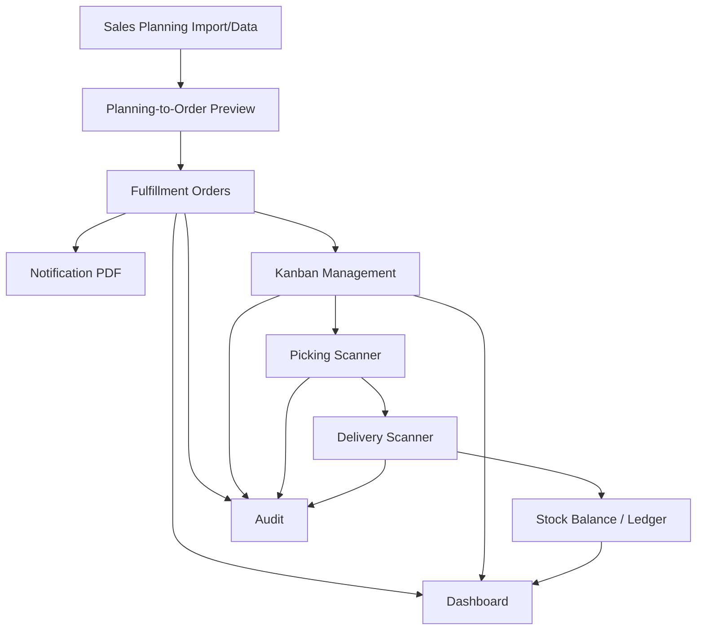
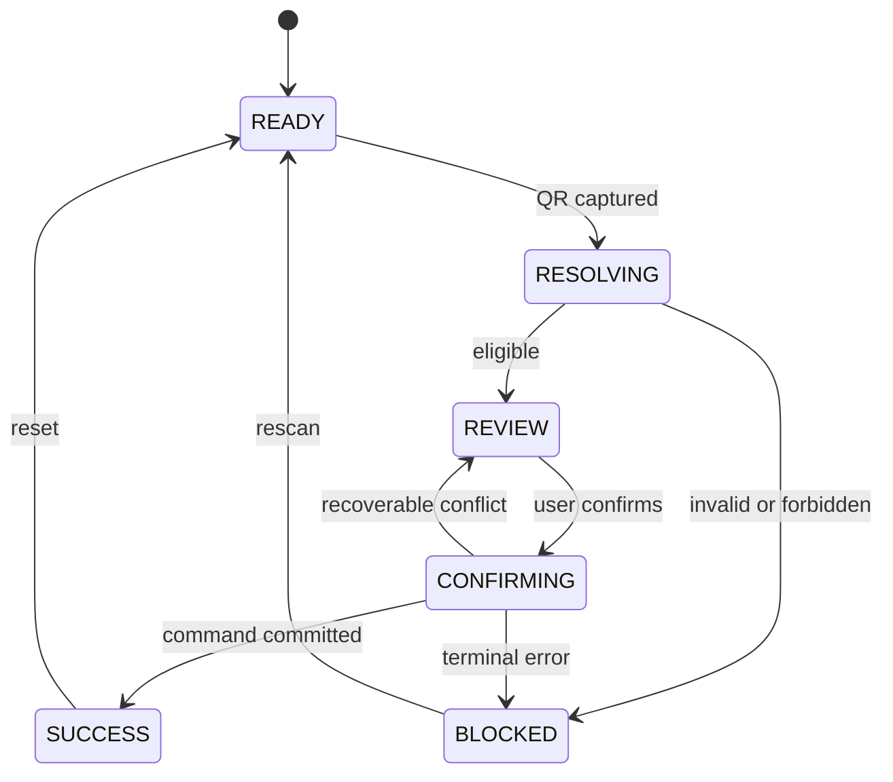
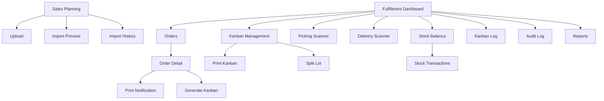

# Order, Kanban and Delivery Management

## Frontend Requirements - Phase 1 to Phase 6

## Document Status

| Item | Value |
|------|-------|
| Date | 2026-07-07 |
| Status | Review draft |
| Framework | Next.js 16 App Router, React 19, strict TypeScript |
| UI | TailwindCSS 4, Material UI 6, existing shared components |
| API namespace | `/fulfillment/*` plus existing `/sales-planning/*` |
| Backend contract | `2026-07-07-order-kanban-delivery-backend-requirements.md` |

This document defines frontend responsibilities only. It preserves existing Sales Planning pages and adds an operational Fulfillment area. It does not change existing Sales Order pages or lifecycle behavior.

---

## Phase 1: Business Requirement

### 1.1 Frontend Objectives

- Provide role-focused workflows for planning import, order generation, printing, Kanban, picking, delivery, stock, audit, and reporting.
- Make stock-impacting actions explicit and resistant to repeated clicks or network retries.
- Keep scanner workflows fast, readable, and usable on desktop, tablet, and mobile camera devices.
- Display the same canonical statuses, permissions, error codes, and quantities defined by the backend contract.
- Preserve all existing project conventions for routes, access policies, services, types, session, toast, and shared components.

### 1.2 Frontend Scope

- Existing Sales Planning upload, preview, history, active data, and export views
- Planning-to-Order preview and explicit generation
- Fulfillment Order list/detail, notification print, and status history
- Kanban preview, generation, print/reprint, detail, log, and split
- Picking and Delivery scanner workflows
- Stock balances and transaction ledger
- Audit log, dashboard, and reports
- Existing user, role, and permission management views with new backend-provided permission codes
- Responsive states, error handling, permission visibility, and Playwright coverage

### 1.3 Frontend Non-Goals

- Parsing Excel as the authoritative validator in the browser
- Direct stock mutation without a backend command
- Direct printer-driver or ZPL integration
- Offline delivery confirmation
- Client-generated Order Codes, Kanban Numbers, stock totals, or state transitions
- Defining permission strings that do not exist in backend seed data

### 1.4 Role Experience

| Role | Default workspace |
|------|-------------------|
| Order Operator | Planning-to-Order and Order List |
| Kanban Operator | Kanban generation and management |
| Warehouse Operator | Picking Scanner |
| Delivery Operator | Delivery Scanner |
| Supervisor | Dashboard, exceptions, cancel, split override, return, audit |
| Auditor/Viewer | Reports, stock ledger, Kanban log, audit log |
| Admin | Existing user and permission management |

---

## Phase 2: System Analysis

### 2.1 Frontend Information Flow



### 2.2 Route Families

| Route family | Responsibility |
|--------------|----------------|
| `/sales-planning/*` | Existing import, validation, history, active planning data |
| `/fulfillment` | Operational dashboard |
| `/fulfillment/orders/*` | Planning preview, generation, order list/detail, notification printing |
| `/fulfillment/kanbans/*` | Kanban list/detail, generation, split, printing, logs |
| `/fulfillment/picking` | Picking scanner workflow |
| `/fulfillment/delivery` | Delivery scanner workflow |
| `/fulfillment/stock/*` | Balance and ledger |
| `/fulfillment/audit` | Audit search |
| `/fulfillment/reports` | Operational reports and exports |
| `/users/*` | Existing user, role, and permission management |

All routes are added to `ROUTES` and `accessControl.ts`; no protected route relies on the fallback policy intentionally.

### 2.3 Client Command Lifecycle

```text
IDLE -> VALIDATING -> CONFIRMING -> SUBMITTING -> SUCCESS
                                      |-> CONFLICT -> REFRESH_REQUIRED
                                      |-> ERROR -> RETRY_READY
```

Rules:

- Generate a new idempotency key when the user opens a confirmation for a new logical command.
- Reuse the same key for network retry of that command.
- Discard the key only after success, explicit cancel, or payload change.
- Disable confirm while submitting.
- A `409` version conflict refreshes the entity before another confirmation.
- A stored idempotent replay is displayed as success, not duplicate failure.

### 2.4 Scanner State Machine



Scanner rules:

- Keep one visible scan target and one primary action.
- Do not confirm automatically after scan.
- Show Kanban, Product, quantity, FG Lot, destination, and projected stock before mutation.
- Clear raw token from visible history after resolution.
- Never place raw QR token in a URL or analytics event.
- Duplicate scan response must explain whether the prior action already succeeded.

### 2.5 Exception Handling

| Backend outcome | Frontend behavior |
|-----------------|-------------------|
| `401` | Existing session-expired redirect behavior |
| `403` | Hide prohibited action and show permission toast if API is called |
| `404` scan token | Blocked scanner state with Rescan action |
| `409 REQUEST_IN_PROGRESS` | Keep current context and offer status refresh |
| `409 STOCK_VERSION_CONFLICT` | Refresh stock/Kanban and require reconfirmation |
| `422 split required` | Link to Split Kanban if permitted |
| Identical idempotent replay | Show original success result |
| `500` | Preserve entered context, show request ID, allow safe retry |

### 2.6 Data Freshness

- Order, Kanban, balance, and scanner detail display `updatedAt` and `version` where relevant.
- Mutation success replaces current entity state from the server response.
- Dashboard and list pages expose manual refresh and last-updated time.
- No optimistic stock or Delivery success is shown before the server commits.

---

## Phase 3: Frontend Data Contract Design

### 3.1 Type Ownership

New API contracts live in `src/types/fulfillment.ts`. Pages and components import them through `@/types/*`. Service files do not define duplicate interfaces.

Core types:

- `FulfillmentOrder`, `FulfillmentOrderItem`, `FulfillmentOrderStatus`
- `FulfillmentOrderSource`, `OrderStatusLog`, `PrintLog`
- `Kanban`, `KanbanStatus`, `KanbanSplit`, `KanbanStatusLog`
- `PickingScanResult`, `PickingTransaction`, `FgLotOption`
- `DeliveryScanResult`, `DeliveryTransaction`
- `StockBalance`, `StockTransaction`, `ReturnTransaction`
- `AuditLog`, `FulfillmentDashboard`, `FulfillmentReportFilters`
- `CommandResult<T>`, `ApiErrorDetail`, pagination filter types

### 3.2 Canonical Status Unions

```typescript
type FulfillmentOrderStatus =
  | "GENERATED"
  | "NOTICE_PRINTED"
  | "KANBAN_READY"
  | "IN_FULFILLMENT"
  | "PARTIALLY_DELIVERED"
  | "DELIVERED"
  | "PARTIALLY_RETURNED"
  | "RETURNED"
  | "CANCELLED";

type KanbanStatus =
  | "GENERATED"
  | "PRINTED"
  | "PICKED"
  | "DELIVERED"
  | "SPLIT"
  | "CANCELLED"
  | "RETURNED";
```

Status labels and colors are defined once in a fulfillment status utility and consumed by shared `StatusBadge`.

### 3.3 Form and Filter Models

- Date fields remain `YYYY-MM-DD` strings until display formatting.
- Quantity fields parse to integers and reject negative, zero where forbidden, decimal, and unsafe values.
- Filter state serializes to URL search parameters for shareable list/report views.
- Confirmation forms include `expectedVersion` from the latest server entity.
- Idempotency keys are command-local state and never stored in the session.

### 3.4 Data Security

- Raw QR values exist only in scanner component memory long enough to resolve the scan.
- Audit JSON values are rendered with safe structured viewers, not raw HTML.
- Export URLs and Blob object URLs are revoked after use.
- UI never infers permission from role name; it uses backend permission codes and current helpers.

---

## Phase 4: Frontend API Integration

### 4.1 Service Structure

| Service | API responsibility |
|---------|--------------------|
| `fulfillmentOrderService` | preview/generate/list/detail/cancel/notification print |
| `kanbanService` | preview/generate/list/detail/print/reprint/split/cancel |
| `pickingService` | scan and confirm allocation |
| `deliveryService` | scan and confirm Delivery |
| `fulfillmentStockService` | balances, transactions, Return |
| `fulfillmentAuditService` | audit search |
| `fulfillmentDashboardService` | KPI and report/export APIs |

All services use object pattern with `apiFetch` or `apiFetchJson`. Blob endpoints use `apiFetch` and `res.blob()`.

### 4.2 Endpoint Consumption Matrix

| Frontend action | Endpoint | Required client behavior |
|-----------------|----------|--------------------------|
| Preview Orders | `POST /fulfillment/orders/preview` | Store preview token and grouped totals |
| Generate Orders | `POST /fulfillment/orders/generate` | Send idempotency key; navigate to results |
| Order PDF | print/reprint endpoints | Download/open Blob; record reason for reprint |
| Preview Kanban | `POST .../kanbans/preview` | Display standard, remainder, override impact |
| Generate Kanban | `POST .../kanbans` | Send idempotency key and item versions |
| Split Kanban | `POST .../split` | Validate total locally and trust server result |
| Picking Scan | `POST /fulfillment/picking/scan` | Keep short-lived scan token only |
| Picking Confirm | `POST /fulfillment/picking/confirm` | Send idempotency key and expected version |
| Delivery Scan | `POST /fulfillment/delivery/scan` | Display allocation and projected stock |
| Delivery Confirm | `POST /fulfillment/delivery/confirm` | Reuse key on retry; never assume success |
| Return | `POST /fulfillment/returns` | Supervisor confirmation and reason |
| Export | `GET /fulfillment/reports/export` | Blob download with server filename |

### 4.3 Error Handling

- Parse `ApiResponse<T>` and established error envelope centrally.
- Map stable error codes to Thai messages and action hints.
- Display request ID in technical detail only when an operation fails.
- Field validation errors appear near inputs; business-state errors appear in an inline banner or modal.
- Use `publishToast()` for success and non-blocking notifications; never use `alert()`.
- Scanner errors stay on screen until acknowledged or rescanned.

### 4.4 Permission Mapping

Frontend constants mirror backend codes exactly:

- `FULFILLMENT_ORDER_GENERATE`, `FULFILLMENT_ORDER_READ`, `FULFILLMENT_ORDER_CANCEL`
- `FULFILLMENT_ORDER_PRINT`, `FULFILLMENT_ORDER_REPRINT`
- `KANBAN_GENERATE`, `KANBAN_READ`, `KANBAN_PRINT`, `KANBAN_REPRINT`, `KANBAN_SPLIT`, `KANBAN_CANCEL`
- `PICKING_SCAN`, `PICKING_CONFIRM`
- `DELIVERY_SCAN`, `DELIVERY_CONFIRM`
- `STOCK_READ`, `STOCK_RETURN`
- `AUDIT_READ`, `FULFILLMENT_DASHBOARD_READ`, `FULFILLMENT_REPORT_READ`, `FULFILLMENT_REPORT_EXPORT`

Constants are added only after the backend publishes exact permission strings.

---

## Phase 5: UX/UI Design

### 5.1 Sitemap



### 5.2 Primary User Flows

```mermaid
graph LR
    A["Upload and commit Sales Planning"] --> B["Select active planning dates"]
    B --> C["Preview Order groups"]
    C --> D["Generate Orders"]
    D --> E["Print Notification"]
    E --> F["Preview and Generate Kanban"]
    F --> G["Print Kanban tags"]
    G --> H["Scan and Confirm Picking"]
    H --> I["Scan and Confirm Delivery"]
    I --> J["Stock OUT and Audit"]
```



Role-specific flow:

- Order Operator: Planning Data -> Order Preview -> Generate -> Notification PDF.
- Kanban Operator: Order Detail -> Kanban Preview -> Generate -> Print or Split.
- Warehouse Operator: Picking Scanner -> Review -> Select FG Lot -> Confirm -> Success.
- Delivery Operator: Delivery Scanner -> Review stock impact -> Confirm -> Success.
- Supervisor: Dashboard exception -> entity detail -> Cancel, Split authorization, or Return -> audit verification.
- Auditor: Report/Stock/Audit filters -> detail trace -> authorized export.

### 5.3 Wireframe Description

List pages use a consistent three-band layout:

1. Compact PageHeader with title and permitted primary action.
2. Unframed filter band with date, status, entity filters, Search, and Clear.
3. Full-width DataTable, PaginationFooter, and result summary.

Detail pages use:

1. Header facts and status actions.
2. Two-column desktop layout with main item/timeline content and a narrow audit/status summary rail.
3. Single-column mobile layout preserving action order and avoiding nested cards.

Scanner pages use:

1. Full-width scan input/camera region at the top.
2. One stable result panel showing Kanban, Product, quantity, destination, and current status.
3. Workflow-specific selection area for FG Lot or projected stock.
4. One primary Confirm action and one Rescan action in a fixed, non-overlapping action region.

High-impact modals use a concise summary table, warning text, optional/required reason input, Cancel, and one destructive or confirming action. Print preview opens the backend PDF rather than recreating the document in HTML.

### 5.4 Global UX Rules

- Operational pages use compact, work-focused layouts without marketing sections.
- Primary actions remain in predictable PageHeader/action areas.
- Scanner pages prioritize camera/input, result, and one confirm button.
- Tables support horizontal overflow without clipping actions on mobile.
- Every page has loading, empty, error, permission-denied, and success behavior.
- Destructive, reprint, split, cancel, delivery, and return actions use confirmation modals.
- Buttons use existing icons and tooltips; binary options use checkbox/toggle controls.
- Dark mode, 375px mobile, tablet, and desktop layouts are required.

### 5.5 Screen Requirements

#### Screen 1: Dashboard

- **Objective:** Show daily operational workload and exceptions.
- **Roles:** Supervisor, Admin, authorized Viewer.
- **Components:** Date/department filters, KPI bands, status charts, exception tables, last-updated indicator.
- **Data:** Orders today, Kanban generated/printed, pending Pick, Picked, pending Delivery, Delivered, Stock OUT, import errors, duplicate scans.
- **Actions:** Refresh, drill into filtered list/report.
- **States:** Skeleton loading; no-activity empty state; widget-level permission skip; retry for failed widgets.

#### Screen 2: Upload Order / Sales Planning

- **Objective:** Upload monthly planning Excel through the existing Sales Planning flow.
- **Roles:** Order Operator with import permission.
- **Components:** Month/year picker, template download, `.xlsx` file input, progress, import history table.
- **Validation:** Period required, `.xlsx`, size limit, no direct authoritative browser parsing.
- **Actions:** Download Template, Upload, Cancel eligible batch, open detail.
- **Feedback:** Upload progress, processing state, toast success, row-level failure link.

#### Screen 3: Import Preview

- **Objective:** Review validated rows, warnings, and errors before commit.
- **Roles:** Order Operator.
- **Components:** Batch summary, status, tabs for rows/errors/warnings, pagination, filters.
- **Table columns:** Row, Customer, Model, Part, Gate, Location, Round, Line, date/quantity, issue.
- **Actions:** Confirm Import when valid, download error report, reprocess/cancel where eligible.
- **States:** Confirm disabled for blocking errors; status polling during processing.

#### Screen 4: Import History

- **Objective:** Search historical Sales Planning batches and versions.
- **Roles:** Order Operator, Supervisor, Auditor.
- **Filters:** Period, status, uploader, upload date.
- **Columns:** Batch code, file, period, version, counts, status, uploaded/committed by and time.
- **Actions:** View detail, download source/error report, restore if permitted by existing Planning rules.
- **Empty/Error:** Contextual no-results and retry states.

#### Screen 5: Order List

- **Objective:** Search and monitor operational fulfillment orders.
- **Roles:** Order Operator, Supervisor, Viewer.
- **Filters:** Sale date, code, Customer, Gate, Location, Round, Line, Product, status.
- **Columns:** Order Code, sale date, Customer, route fields, item count, quantity, Kanban progress, status, updated time.
- **Actions:** Generate from Planning, view detail, print, cancel where eligible, export.
- **Modal:** Generation filter/preview entry and cancel confirmation.

#### Screen 6: Order Detail

- **Objective:** Show complete order lineage and fulfillment progress.
- **Roles:** Order Operator, Kanban Operator, Supervisor, Viewer.
- **Components:** Header facts, item table, planning sources, Kanban progress, status timeline, print history, audit summary.
- **Actions:** Print/Reprint notification, preview/generate Kanban, cancel, open Kanban detail, and inspect Return progress.
- **Validation:** Actions derive from server-provided status and permission, not client assumptions.
- **States:** Section-level loading and refresh after mutation.

#### Screen 7: Print Notification

- **Objective:** Generate and open A4 notification PDF.
- **Roles:** Order Operator.
- **Components:** Document summary, print type, prior print count, PDF loading state.
- **Actions:** Original Print or Reprint.
- **Modal:** Reprint reason required.
- **Feedback:** Open/download Blob, revoke object URL, show print-log sequence.

#### Screen 8: Kanban Management

- **Objective:** Search all Kanban and operational status.
- **Roles:** Kanban Operator, Warehouse, Delivery, Supervisor, Viewer.
- **Filters:** Kanban, Order, Customer, Product, FG Lot, status, dates, destination.
- **Columns:** Kanban Number, Order, Part, quantity, lot sequence, FG Lot, location, status, print/pick/delivery times.
- **Actions:** View, print/reprint, split, cancel where eligible, and full Return for delivered Kanban when authorized.
- **States:** Stable row dimensions and explicit unavailable-action tooltips.

#### Screen 9: Generate Kanban

- **Objective:** Preview and generate standard/remainder lots for Order Items.
- **Roles:** Kanban Operator; Supervisor for override.
- **Components:** Item selection, standard quantity snapshot, calculated lot preview, total reconciliation.
- **Validation:** Positive integer lot size; total Kanban quantity equals item quantity.
- **Actions:** Generate, override with reason, reset to Product Master value.
- **Modal:** Final generation confirmation showing count and total.

#### Screen 10: Print Kanban

- **Objective:** Generate and open Kanban tag PDF.
- **Roles:** Kanban Operator.
- **Components:** Tag preview metadata, selection count, print history.
- **Actions:** Original Print, batch print, Reprint.
- **Modal:** Mandatory reason for reprint.
- **Error:** PDF failure preserves selected Kanban for retry.

#### Screen 11: Split Lot

- **Objective:** Split one eligible Kanban into atomic children.
- **Roles:** Kanban Operator; Supervisor for picked Kanban.
- **Components:** Parent summary, dynamic child quantity rows, remaining quantity indicator.
- **Validation:** Positive integers; exact sum; minimum two children; reason required.
- **Actions:** Add/remove child row, confirm split.
- **Success:** Show child numbers and direct print action; parent displayed as retired.

#### Screen 12: Picking QR Scanner

- **Objective:** Resolve Kanban and confirm one FG Lot allocation.
- **Roles:** Warehouse Operator.
- **Components:** camera/keyboard scan input, Kanban result, eligible FG Lot list, warehouse selector, confirm button.
- **Validation:** Full quantity available in one lot; status eligible; permission granted.
- **Actions:** Scan, select lot, Confirm Picking, Rescan, open Split when required.
- **Feedback:** Persistent success panel with Kanban, lot, quantity, actor time; scanner resets explicitly.

#### Screen 13: Delivery QR Scanner

- **Objective:** Confirm delivery and atomic Stock OUT.
- **Roles:** Delivery Operator.
- **Components:** scan input, picked allocation, destination, projected before/after stock, confirm button.
- **Validation:** Picked status, allocation exact, versions current.
- **Actions:** Scan, Confirm Delivery, Rescan.
- **Modal:** High-impact confirmation with Product, FG Lot, quantity, destination.
- **Feedback:** Idempotent retry appears as successful prior result; conflicts require refresh/rescan.

#### Screen 14: Stock Balance

- **Objective:** View current FG stock projection.
- **Roles:** Warehouse, Supervisor, Viewer.
- **Filters:** Product/Part, FG Lot, Warehouse Location, availability, updated date.
- **Columns:** Product, FG Lot, location, on-hand, allocated, available, version, updated time.
- **Actions:** View transactions, export if permitted.
- **States:** Negative values are never rendered as valid; reconciliation warning is explicit.

#### Screen 15: Stock Transactions

- **Objective:** Inspect immutable stock ledger.
- **Roles:** Supervisor, Auditor, Viewer.
- **Filters:** Type, date, Product, FG Lot, location, Kanban, Order, user, request ID.
- **Columns:** Transaction code/type, references, quantity, before/after, actor, timestamp.
- **Actions:** View related Order/Kanban/Delivery/Return, export.
- **Constraint:** No edit or delete actions.

#### Screen 16: Kanban Log

- **Objective:** Trace Kanban lifecycle and physical processing.
- **Roles:** Supervisor, Auditor, Viewer.
- **Filters:** Kanban, parent, Order, Product, status, actor, date.
- **Columns:** Event, old/new status, quantity, FG Lot, actor, timestamp, request ID.
- **Actions:** Open entity and related split tree.
- **Constraint:** Read-only immutable timeline.

#### Screen 17: Audit Log

- **Objective:** Search cross-domain business actions.
- **Roles:** Supervisor, Auditor, Admin.
- **Filters:** Action, entity, user, department, date, request ID.
- **Columns:** Time, actor, department, action, entity, remark, request ID.
- **Modal:** Structured old/new value comparison.
- **Constraint:** Read-only; sensitive fields masked according to backend response.

#### Screen 18: Report

- **Objective:** Analyze operational performance and export authorized data.
- **Roles:** Supervisor, Viewer.
- **Filters:** Date range, Customer, Gate, Location, Round, Line, Product, status.
- **Views:** Order summary, Kanban throughput, Picking/Delivery lead time, Stock OUT, exceptions.
- **Actions:** Apply/Clear filters, export Excel, drill to source records.
- **States:** Report generation progress and authorized download state.

#### Screen 19: User Management

- **Objective:** Assign users, departments, and roles using the existing module.
- **Roles:** Admin.
- **Components:** Existing user table/forms extended only by backend-provided fulfillment roles.
- **Actions:** Assign role/department, activate/deactivate according to existing rules.
- **Validation:** No hardcoded new permission values in page code.

#### Screen 20: Role and Permission Management

- **Objective:** Assign action-based fulfillment permissions.
- **Roles:** Admin.
- **Components:** Existing role detail and permission matrix grouped by Fulfillment module.
- **Actions:** Select permissions, save role, inspect affected users.
- **Validation:** Backend permission catalog is the source of truth.
- **Feedback:** Save result via toast and refreshed role data.

### 5.6 Screen State Coverage Matrix

| Screen | Search / Filter | Modal | Validation | Loading / Empty / Error | Success feedback |
|--------|-----------------|-------|------------|-------------------------|------------------|
| Dashboard | Date, department; no free text | None | Valid date scope | Widget skeleton / no activity / widget retry | Last-updated timestamp |
| Upload Order | Period and history filters | Cancel batch | Period, `.xlsx`, size | Upload progress / no history / upload error | Toast and batch link |
| Import Preview | Row, severity, field | Confirm Import | Zero blocking errors | Polling / no rows / issue table error | Committed status and toast |
| Import History | Period, status, uploader, date | Restore/Cancel | Eligible batch status | Table loading / no batches / retry | Refreshed version status |
| Order List | Code and all route/status fields | Generate entry, Cancel | Filter date range and action eligibility | Table loading / no orders / retry | Generated/cancelled toast |
| Order Detail | Timeline/item local filters | Cancel, Reprint | Server status/version | Section skeleton / no Kanban / refresh error | Updated entity state |
| Print Notification | No search | Reprint reason | Reason and print eligibility | PDF generation / no prior print / PDF error | PDF opened and log sequence |
| Kanban Management | Number, Order, Product, FG Lot, status | Cancel, Reprint | Server action eligibility | Table loading / no Kanban / retry | Updated row and toast |
| Generate Kanban | Item selection | Final Generate | Positive lot size and exact total | Preview loading / no eligible items / preview error | Generated Kanban links |
| Print Kanban | Kanban selection | Reprint reason | Eligible selection and reason | PDF loading / no selection / PDF error | PDF opened and print count |
| Split Lot | No search | Final Split | Two or more positive children, exact total | Parent loading / ineligible parent / conflict | Child list and print action |
| Picking Scanner | QR and FG Lot search | Confirm Picking | Eligible status, one sufficient FG Lot | Resolving / no eligible lot / blocked result | Persistent picked result |
| Delivery Scanner | QR only | Confirm Delivery | Picked, current versions, sufficient stock | Resolving / no allocation / conflict | Persistent Delivery/OUT result |
| Stock Balance | Product, FG Lot, location, availability | None | Valid numeric/date filters | Table loading / no balance / retry | Export/download toast |
| Stock Transactions | Type, references, actor, date | Transaction detail | Valid date range | Table loading / no transactions / retry | Export/download toast |
| Kanban Log | Kanban, parent, Order, actor, date | Event detail | Valid date range | Timeline loading / no events / retry | Navigation feedback only |
| Audit Log | Action, entity, user, request ID, date | Old/New comparison | Audit permission and date range | Table loading / no audit / retry | Export/download toast |
| Report | Date and business dimensions | Export confirmation when large | Bounded date range | Report progress / no results / generation error | Download ready |
| User Management | Existing user filters | Existing create/edit/assign dialogs | Existing user/domain rules | Existing shared states | Toast and refreshed user |
| Role & Permission | Role/permission search | Existing role dialogs | Backend catalog and role rules | Existing shared states | Toast and refreshed role |

### 5.7 Responsive and Accessibility Requirements

- Scanner pages work at 375px width without overlapping controls.
- Tables provide accessible labels and keyboard-reachable row actions.
- Modal focus is trapped and returned to the invoking control.
- Status is communicated by text and icon, not color alone.
- Camera denial offers keyboard/manual scanner fallback.
- Form errors are linked to fields and announced to assistive technology.
- Touch targets meet practical warehouse use requirements.

---

## Phase 6: Frontend Development Plan

### 6.1 Proposed Frontend Structure

```text
src/app/(admin)/fulfillment/
  page.tsx
  orders/page.tsx
  orders/generate/page.tsx
  orders/[id]/page.tsx
  kanbans/page.tsx
  kanbans/[id]/page.tsx
  kanbans/[id]/split/page.tsx
  picking/page.tsx
  delivery/page.tsx
  stock/page.tsx
  stock/transactions/page.tsx
  audit/page.tsx
  reports/page.tsx

src/components/fulfillment/
  orders/
  kanban/
  scanner/
  stock/
  audit/
  dashboard/

src/services/fulfillment/
src/types/fulfillment.ts
src/constants/fulfillmentStatus.ts
```

Existing Sales Planning pages remain under `/sales-planning/*` and are integrated through links and shared source identifiers rather than moved.

### 6.2 Development Sequence

1. Backend contract fixtures, TypeScript types, routes, permissions, and access policies.
2. Service objects and centralized fulfillment error/status mappings.
3. Order generation preview, Order List, and Order Detail.
4. Notification PDF and print/reprint UX.
5. Kanban preview/generation, list/detail, print, and split.
6. Shared scanner shell and Picking workflow.
7. Delivery workflow with idempotency key lifecycle.
8. Stock balance/ledger and Return workflow.
9. Audit, Kanban Log, dashboard, reports, and exports.
10. Responsive, dark-mode, accessibility, route, permission, visual, and E2E verification.

### 6.3 Frontend Test Strategy

Unit tests for pure utilities:

- Status label/color mapping
- Quantity and exact-sum validation
- Filter serialization
- Idempotency command-state helper
- API error-code message mapping

MSW contract fixtures:

- Every list/detail/scan/confirm endpoint
- Success, permission denial, not found, state conflict, version conflict, and unexpected error
- Identical idempotent replay and mismatched-key payload
- Blob PDF/export responses

Playwright E2E:

- Generate Order preview and duplicate prevention response
- Original print and reason-required reprint
- Standard/remainder Kanban generation
- Split validation and success children
- Picking scan, insufficient FG Lot, and successful allocation
- Delivery scan, confirmation, retry, conflict, and duplicate result
- Cancellation allocation release and Return flow
- Stock and Audit read-only behavior
- Permission-based visibility and direct-route denial
- Mobile scanner viewport and camera-denied fallback

Visual regression:

- Dashboard desktop/mobile
- Order and Kanban detail
- Picking and Delivery scanner states
- Split modal/page
- Stock ledger and Audit detail modal

### 6.4 Frontend UAT Scenarios

1. Order Operator generates orders from selected active planning dates.
2. Repeating Generate shows existing results without duplicates.
3. Notification Original/Reprint logs display correctly.
4. Kanban Operator generates standard and remainder lots.
5. Supervisor override and split reasons are mandatory.
6. Warehouse scans, selects one FG Lot, and confirms Picking without stock reduction.
7. Delivery Operator sees projected stock and confirms Delivery once.
8. Network retry shows the original Delivery success.
9. Version conflict requires rescan/reconfirmation.
10. Supervisor cancels Picked Kanban and sees allocation released.
11. Supervisor returns a full delivered Kanban without altering original OUT and sees Order Return status.
12. Viewer can inspect but cannot mutate Stock/Audit data.

### 6.5 Required Verification

```bash
pnpm routes:gen
pnpm build
pnpm lint
pnpm test:e2e
```

Manual browser verification includes desktop, tablet, 375px mobile, dark mode, camera denied, keyboard-wedge scanner, PDF Blob handling, and no overlapping controls.

### 6.6 Frontend Definition of Done

- Routes and access policies cover every new page.
- Types match the approved backend OpenAPI contract.
- All calls use service objects and `apiFetch`/`apiFetchJson`.
- Loading, empty, error, success, permission, and conflict states are implemented.
- Stock-impacting actions require explicit confirmation and use stable idempotency keys.
- E2E tests cover happy paths, business-rule failures, permission denial, retries, and mobile scanner UX.
- Build, lint, route generation, and E2E verification pass.
